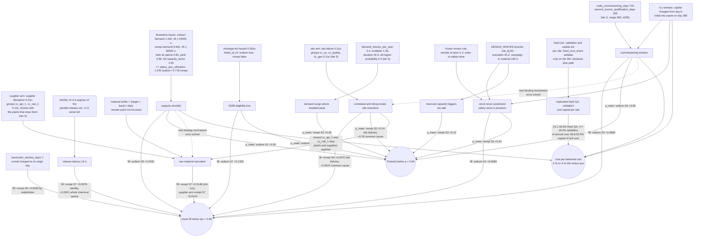

# Phase A: bottleneck decomposition

**PRELIMINARY / ILLUSTRATIVE / NOT FOR EXTERNAL CLAIMS.** Every numeric input driving the runs below is tier 5
(illustrative) except four release-time components. Everything here describes model behavior under those inputs.
Nothing here is a statement about sterile-injectable manufacturing in the world, and nothing here may be quoted
outside this package. All runs quoted here predate protocol revisions R004 and R005 (2026-09-03) and are superseded
for quantitative use; see section 7, Status of each defect.

## 1. Purpose and banner

The frozen service target is `protocol/protocol.yaml` v1.0.0: mean fill rate at or above tau = 0.99, achieved in at
least q = 0.90 of runs. Against the optimizer's own best-or-closest designs,
`by_key["base|<product>|<strategy>"].feasible` is false in 16 of 16 product x strategy cells. This document asks why,
factor by factor, and separates three different reasons a cell can fail:

- **structural**: the mechanism holds at every point of every declared range, so no evidence inside those ranges
changes it; - **assumption-dependent**: the mechanism appears or vanishes inside the parameter's own declared
low..high range in `config/`, so it is a statement about a tier-5 number; - **model artifact**: the mechanism is
produced by an implementation or search choice, not by anything the model claims about the world.

A mechanism can be an artifact and still be invariant to every searched parameter, which is not the same as being
structural. The frozen regional review rule (6.3) and the release-queue max() arithmetic (6.6) are both of that kind:
they are hard-coded, no config parameter stands behind them, and no run in this package can move them. Where that
applies, this document says *artifact, invariant to every searched parameter*, and reserves "structural" for
mechanisms that survive their declared ranges.

It is deliberately not a defence of the distributed-microplant thesis. Two of the three largest single levers found
here (the frozen regional review rule and the 730-day commissioning window) are model or input choices rather than
physics, and the largest capacity effect exists only for the product whose illustrative inputs put its incumbent plant
above 100% utilization. Said plainly: on this evidence the sentence "no strategy meets the frozen service target" is
substantially a statement about the harness, not yet about distributed manufacturing.

Deliverable 3 of `docs/design_space/ASSIGNMENT.md`. Written before any S8+ architecture is generated, as that
assignment requires.

## 2. Method

### 2.1 Ablation design

Factors are defined in `src/telo_feasibility/ablation.py` (`FACTORS`). Kind `mechanism` gets both a leave-one-out and
an add-one-in arm; kind `cost` changes cost only and has no add-one-in arm; kind `structure` is a measurement or
protocol rule; `material_buffer` is leave-one-out only because the quiet world has no stockouts to remove.

| id | family | kind | what switching it off does |
|---|---|---|---|
| capacity_shortfall | capacity | mechanism | rescales `batches_per_site_year_nominal` so the status-quo plant sits at 75% utilization instead of its illustrative value |
| surge_headroom | demand | mechanism | `demand_shocks_per_year` 0.4 -> 0 (no compound demand shocks) |
| inventory_timing | inventory | mechanism | regional policy switched to daily base-stock review (`region_base_stock` 1.0) instead of the frozen reorder-at-lane-time-plus-one-day rule |
| api_lead_time | supply | mechanism | `material_lead_time_days` 90 -> 7 |
| component_lead_time | supply | mechanism | `component_lead_fraction` 0.5 -> 0.05 (vial and stopper lead) |
| material_buffer | supply | mechanism (loo only) | `material_target_days` -> 1000, so no batch ever waits for API, vials, or stoppers |
| release_queue | release | mechanism | assay, endotoxin, environmental monitoring, QA review all -> 0 days (sterility kept) |
| sterility_delay | release | mechanism | `sterility_incubation_days` 14 -> 0 (other release components kept) |
| deviation_rejection | quality | mechanism | `deviation_rate_per_batch`, `batch_rejection_rate`, `yield_sd` all -> 0 |
| demand_variance | demand | mechanism | `demand_cv` 0.15 -> 0 and `demand_autocorrelation` 0.3 -> 0 |
| demand_covariance | demand | mechanism | `demand_shock_all_regions_probability` 0.5 -> 0 (shocks hit one region at a time) |
| common_cause | dependence | mechanism | `common_cause_events_per_year` 0.1 -> 0 (shared API, vial, geography, OS, quality unit) |
| supplier_concentration | supply | mechanism | `supplier_disruptions_per_supplier_year` 0.2 -> 0 |
| site_failures | capacity | mechanism | `site_failures_per_site_year` 0.2 -> 0 |
| contract_insufficiency | contract | mechanism | reserved capacity activates instantly (lead 21 -> 0 d), at full reservation (fraction -> 1.0), with 12-batch campaigns |
| regulatory_unavailability | regulatory | mechanism | product listed at t0 and `shortage_list_resolution_rate_per_year` -> 0, so the 503B responder never loses eligibility |
| commissioning_delay | time | mechanism | `node_commissioning_days` 730 -> 0 and `second_source_qualification_days` 365 -> 0; S2's second source exists at t0 |
| fixed_quality_cost | cost | cost | `fixed_qa_labor_usd_per_site_year` -> 0 |
| replicated_validation_cost | cost | cost | `validation_usd_one_time` -> 0 |
| capital_cost | cost | cost | `capital_usd_per_site` -> 0 |
| lost_sales_window | structure | structure | `backorder_window_days` 7 -> 30 (measurement rule for lost demand) |
| horizon_10y | structure | structure | measured window 5 y -> 10 y |

### 2.2 Leave-one-out, add-one-in, and why they bracket

Leave-one-out (`loo:<f>`) is the base world with mechanism f switched off, so `loo_delta = loo - base` is f's marginal
contribution when every other mechanism is present. Add-one-in (`addin:<f>`) is the quiet world (all mechanisms off)
with f alone switched back on, so `addin_delta = quiet_all - addin` is f's marginal damage when no other mechanism is
present. A Shapley value averages marginal contributions over all coalitions; these two are the full-coalition and
empty-coalition ends, and `attribution.csv` records them as `shapley_bracket_fill_low/high`. The bracket is wide here
because most factors do nothing alone: `by_key["quiet_all|
|<s>"].fill_rate.mean = 1.000000` and `p_meet = 1.00` in
all 16 cells, and only four add-in configurations break feasibility anywhere (capacity_shortfall 12 of 16 cells still
feasible, site_failures 13, common_cause 14, supplier_concentration 14; every other add-in leaves all 16 feasible).
Two consequences. First, the quiet world is a ceiling at fill 1.0, so add-in deltas are censored from above and cannot
be ranked reliably. Second, most of what this decomposition measures is interaction, not main effect.

### 2.3 Common random numbers, N, and MCSE

`run_paired` draws one set of demand, disruption, quality, and release streams per run index from `master_seed =
20260901` and replays it across every configuration, so a paired difference over the 100 matched rows in `results.csv`
has a much smaller standard error than the marginal MCSE in `summary.json`. Example:
`by_key["base|sodium_bicarbonate_8_4_50ml|S0"].fill_rate.mcse = 0.003722` against a paired SE of 0.002098 for
`loo:capacity_shortfall` on the same cell. Both are reported below; the paired statistic is the correct one for a
factor delta and the marginal MCSE is the correct one for a level. `p_meet` is a proportion over n = 100, so its grid
is 0.01 and its binomial standard error near q = 0.90 is about 0.030. Any feasibility flip that lands on p_meet = 0.90
or 0.91 is inside that noise and is flagged as such below.

**Resolution rule.** A factor is called *statistically resolved* in a cell when the two-sided paired t of the
leave-one-out minus base difference over the 100 matched rows of `results.csv` exceeds the 5% critical value of
Student's t with 99 degrees of freedom, |t| > 1.984. Every "resolved in N of 16" count in sections 4 and 6 is that
rule and nothing else; the counts recomputed under it are capacity shortfall 9, surge headroom 9, inventory timing 11,
API lead time 8, component lead time 8, release queue 9, sterility delay 14, deviation and rejection 9, demand
variance 3, demand covariance 7, common cause 13, supplier concentration 10, site failures 16, contract insufficiency
2, regulatory unavailability 2, commissioning delay 8, lost-sales window 16, horizon 11. Resolution is not
materiality: a resolved delta can still be far too small to move a cell, and section 4's "binds for" column requires
both resolution and a delta large enough to change the violated dimension (a feasibility flip, or a move of the same
order as the cell's gap to tau). The earlier draft of this document stated no rule and was not self-consistent: its
sterility count of 15 is reachable only at a one-sided 1.645 cut, its supplier-concentration count of 11 is reachable
at no threshold at all (sodium S5 and S6 are bit-identical at t = +1.70 and must enter or leave together), and section
6.6 used the marginal MCSE where the paired statistic belongs.

### 2.4 Designs, horizon, and scope

Designs are the frozen-target optimization run `opt_20260902T043854Z`, best where one exists and closest grid point
otherwise (`meta.design_variables`). Measured horizon is 5.0 years after a 365-day warm-up. Products are
`sodium_bicarbonate_8_4_50ml` (`meta.status_quo_utilization = 1.2449424214130098`, `meta.listed_at_t0 = true`) and
`norepinephrine_1mgml_4ml` (0.7780890133831311, `false`). `meta.eligibility` is `NO_CONCLUSION` for all of S0 through
S7 because all 15 regulatory gates are UNCERTAIN, so no cell here may be read as a regulatory conclusion.

Not covered by this run: one product per network, so no portfolio pooling and no shared fixed cost across
presentations; equal regional demand shares; costs and mechanisms of any S8+ architecture; interactions other than the
three-factor set in `abl_20260902_phaseA_pairs`; any add-one-in arm for the three cost factors; and the alternate
service target.

That last omission is worth stating plainly, because the assignment names the tau = 0.98 dimension as one of the four
premises Phase A was asked to decompose. `meta.tau_alt = 0.98`, and every one of the 656 `by_key` entries carries
`p_meet_alt` and `feasible_alt`, but no finding below reads them. At base, `feasible_alt` is true in 5 of 16 cells
(sodium S2 `p_meet_alt` 0.96, sodium S3 0.97, norepinephrine S2 0.97, S3 0.97, S4 0.92), so on these frozen-target
designs the assignment's premise that at fill >= 0.98 only dual sourcing clears is not what the run produces: the S3
reserved-contract cells clear for both products, and norepinephrine S4 clears as well. Decomposing that dimension per
mode is Phase A work that was not done here.

Supporting runs used and named where cited: `abl_20260902_phaseA_mb` (base plus `loo:material_buffer`),
`abl_20260902_phaseA_bounds` and `_bounds_ss` (search-bound relaxations), and `abl_20260903_ci_sublevers_*` (contract
sub-levers). All share `master_seed = 20260901` and the same designs, and every one of them reproduces the main run's
16 base `fill_rate.mean` values to within 1e-12, so service comparisons across runs are valid. Base
`annual_total_cost` does differ: protocol revision R003 (2026-09-02) added a carrying charge on raw-material stock
after the main and `_mb` runs were written, so for example `base|norepinephrine_1mgml_4ml|S0` costs 12,720,916.95
USD/yr in the main run and 12,751,716.55 in `_pairs`. Cost figures are therefore quoted only within a run, never
across runs, and every cost number below is pre-R003.

One further artifact is cited three times below and is *not* one of those runs: `results/sensitivity/one_way.json`
(`meta.runs_per_scenario = 6`, `meta.horizon_days = 1095`, `meta.product = sodium_bicarbonate_8_4_50ml` only, and a
design set that differs from `meta.design_variables` here at S0 `safety_stock_days` 30.0 against 33.33, S1 180.0
against 197.5, S4 `capacity_factor` 1.45 against 2.5, and S5 with no `node_scale` at all). Its base sodium S0
`mean_fill` is 0.7640601893438563 against `by_key["base|sodium_bicarbonate_8_4_50ml|S0"].fill_rate.mean = 0.720200`,
so its levels are not comparable with the ablation's and its deltas are not on the same footing. At n = 6 the `p_meet`
grid is 1/6 = 0.167 and the binomial standard error near 0.9 is about 0.12, so "no strategy changes `p_meet`" in that
file is weak evidence, not corroboration. Every citation of it below repeats this qualifier.

## 3. Results tables

Generated by, and reproduced verbatim from:

    cd ~/telo/feasibility && uv run python scripts/build_bottleneck_tables.py \
        --run abl_20260902_phaseA --pairs-run abl_20260902_phaseA_pairs

The script emits 584 lines. Its full stdout is kept unedited in the companion generated artifact
[`bottleneck_tables.md`](bottleneck_tables.md). Pasted below are the two decision metrics (mean fill and the tail
probability) and both interaction tables. The shortage-days and capacity-utilization ladders and the 16 per-cell
attribution tables (one per product x strategy, every factor ranked with `loo_delta_fill_rate`,
`addin_delta_fill_rate`, `loo_delta_p_meet`, `addin_delta_p_meet`, `loo_delta_shortage_days_per_year`,
`loo_delta_annual_total_cost`) would add about 490 lines and live only in that file; sections 4 to 7 cite them as
"attribution table, `<product>`, `<strategy>`".

Run `abl_20260902_phaseA`: 100 common-random-number runs per configuration, master seed 20260901, horizon 5.0 y after 365 d warm-up, tau = 0.99, q = 0.9, designs = optimized:opt_20260902T043854Z. Status-quo utilization (demand / effective saleable capacity of the S0 plant): sodium_bicarbonate_8_4_50ml 1.245, norepinephrine_1mgml_4ml 0.778. PRELIMINARY / ILLUSTRATIVE / NOT FOR EXTERNAL CLAIMS. All runs quoted here predate protocol revisions R004 and R005 (2026-09-03) and are superseded for quantitative use; see section 7, Status of each defect.

**Mean fill rate by configuration (fraction)**

| configuration | sodium S0 | sodium S1 | sodium S2 | sodium S3 | sodium S4 | sodium S5 | sodium S6 | sodium S7 | norepinephrine S0 | norepinephrine S1 | norepinephrine S2 | norepinephrine S3 | norepinephrine S4 | norepinephrine S5 | norepinephrine S6 | norepinephrine S7 |
|---|---|---|---|---|---|---|---|---|---|---|---|---|---|---|---|---|
| base | 0.720 | 0.728 | 0.993 | 0.993 | 0.993 | 0.932 | 0.932 | 0.866 | 0.983 | 0.985 | 0.993 | 0.993 | 0.993 | 0.990 | 0.990 | 0.957 |
| loo:capacity_shortfall | 0.973 | 0.982 | 0.999 | 0.993 | 0.993 | 0.992 | 0.992 | 0.972 | 0.985 | 0.986 | 0.994 | 0.993 | 0.993 | 0.991 | 0.991 | 0.958 |
| loo:surge_headroom | 0.727 | 0.735 | 0.993 | 0.993 | 0.993 | 0.933 | 0.933 | 0.871 | 0.986 | 0.987 | 0.993 | 0.994 | 0.993 | 0.990 | 0.990 | 0.959 |
| loo:inventory_timing | 0.721 | 0.797 | 0.997 | 0.997 | 0.999 | 0.932 | 0.932 | 0.891 | 0.995 | 0.997 | 0.997 | 0.997 | 0.999 | 0.990 | 0.990 | 0.976 |
| loo:api_lead_time | 0.718 | 0.728 | 0.992 | 0.989 | 0.991 | 0.813 | 0.813 | 0.864 | 0.984 | 0.986 | 0.992 | 0.990 | 0.993 | 0.954 | 0.954 | 0.954 |
| loo:component_lead_time | 0.719 | 0.729 | 0.992 | 0.991 | 0.991 | 0.811 | 0.811 | 0.864 | 0.983 | 0.985 | 0.992 | 0.991 | 0.993 | 0.954 | 0.954 | 0.955 |
| loo:release_queue | 0.720 | 0.729 | 0.993 | 0.993 | 0.993 | 0.933 | 0.933 | 0.868 | 0.984 | 0.987 | 0.992 | 0.993 | 0.994 | 0.990 | 0.990 | 0.959 |
| loo:sterility_delay | 0.720 | 0.730 | 0.994 | 0.995 | 0.994 | 0.933 | 0.933 | 0.870 | 0.986 | 0.989 | 0.995 | 0.995 | 0.996 | 0.991 | 0.991 | 0.965 |
| loo:deviation_rejection | 0.727 | 0.735 | 0.993 | 0.992 | 0.993 | 0.934 | 0.934 | 0.870 | 0.985 | 0.986 | 0.993 | 0.993 | 0.994 | 0.991 | 0.991 | 0.960 |
| loo:demand_variance | 0.720 | 0.728 | 0.992 | 0.994 | 0.992 | 0.932 | 0.932 | 0.867 | 0.980 | 0.980 | 0.992 | 0.994 | 0.993 | 0.990 | 0.990 | 0.955 |
| loo:demand_covariance | 0.724 | 0.733 | 0.993 | 0.994 | 0.993 | 0.933 | 0.933 | 0.869 | 0.985 | 0.986 | 0.993 | 0.993 | 0.993 | 0.990 | 0.990 | 0.958 |
| loo:common_cause | 0.743 | 0.753 | 0.995 | 0.993 | 0.993 | 0.936 | 0.936 | 0.878 | 0.991 | 0.991 | 0.994 | 0.993 | 0.994 | 0.992 | 0.992 | 0.967 |
| loo:supplier_concentration | 0.725 | 0.734 | 0.994 | 0.995 | 0.995 | 0.934 | 0.934 | 0.873 | 0.989 | 0.990 | 0.994 | 0.995 | 0.996 | 0.994 | 0.994 | 0.972 |
| loo:site_failures | 0.739 | 0.748 | 0.994 | 0.995 | 0.995 | 0.935 | 0.935 | 0.879 | 0.990 | 0.992 | 0.994 | 0.995 | 0.995 | 0.993 | 0.993 | 0.970 |
| loo:contract_insufficiency | 0.720 | 0.728 | 0.993 | 0.996 | 0.993 | 0.932 | 0.932 | 0.866 | 0.983 | 0.985 | 0.993 | 0.997 | 0.993 | 0.990 | 0.990 | 0.957 |
| loo:regulatory_unavailability | 0.720 | 0.728 | 0.993 | 0.993 | 0.993 | 0.932 | 0.932 | 0.997 | 0.983 | 0.985 | 0.993 | 0.993 | 0.993 | 0.990 | 0.990 | 0.997 |
| loo:commissioning_delay | 0.720 | 0.728 | 0.997 | 0.993 | 1.000 | 0.999 | 0.999 | 0.866 | 0.983 | 0.985 | 0.997 | 0.993 | 0.999 | 0.999 | 0.999 | 0.957 |
| loo:fixed_quality_cost | 0.720 | 0.728 | 0.993 | 0.993 | 0.993 | 0.932 | 0.932 | 0.866 | 0.983 | 0.985 | 0.993 | 0.993 | 0.993 | 0.990 | 0.990 | 0.957 |
| loo:replicated_validation_cost | 0.720 | 0.728 | 0.993 | 0.993 | 0.993 | 0.932 | 0.932 | 0.866 | 0.983 | 0.985 | 0.993 | 0.993 | 0.993 | 0.990 | 0.990 | 0.957 |
| loo:capital_cost | 0.720 | 0.728 | 0.993 | 0.993 | 0.993 | 0.932 | 0.932 | 0.866 | 0.983 | 0.985 | 0.993 | 0.993 | 0.993 | 0.990 | 0.990 | 0.957 |
| loo:lost_sales_window | 0.714 | 0.725 | 0.996 | 0.998 | 0.995 | 0.937 | 0.937 | 0.869 | 0.989 | 0.991 | 0.997 | 0.998 | 0.998 | 0.993 | 0.993 | 0.973 |
| loo:horizon_10y | 0.704 | 0.708 | 0.996 | 0.992 | 0.996 | 0.966 | 0.966 | 0.833 | 0.984 | 0.985 | 0.996 | 0.993 | 0.996 | 0.994 | 0.994 | 0.959 |
| quiet_all | 1.000 | 1.000 | 1.000 | 1.000 | 1.000 | 1.000 | 1.000 | 1.000 | 1.000 | 1.000 | 1.000 | 1.000 | 1.000 | 1.000 | 1.000 | 1.000 |
| addin:capacity_shortfall | 0.794 | 0.881 | 1.000 | 1.000 | 1.000 | 0.878 | 0.878 | 1.000 | 1.000 | 1.000 | 1.000 | 1.000 | 1.000 | 1.000 | 1.000 | 1.000 |
| addin:surge_headroom | 1.000 | 1.000 | 1.000 | 1.000 | 1.000 | 1.000 | 1.000 | 1.000 | 1.000 | 1.000 | 1.000 | 1.000 | 1.000 | 1.000 | 1.000 | 1.000 |
| addin:inventory_timing | 1.000 | 1.000 | 1.000 | 1.000 | 1.000 | 1.000 | 1.000 | 1.000 | 1.000 | 1.000 | 1.000 | 1.000 | 1.000 | 1.000 | 1.000 | 1.000 |
| addin:api_lead_time | 1.000 | 1.000 | 1.000 | 1.000 | 1.000 | 1.000 | 1.000 | 1.000 | 1.000 | 1.000 | 1.000 | 1.000 | 1.000 | 1.000 | 1.000 | 1.000 |
| addin:component_lead_time | 1.000 | 1.000 | 1.000 | 1.000 | 1.000 | 1.000 | 1.000 | 1.000 | 1.000 | 1.000 | 1.000 | 1.000 | 1.000 | 1.000 | 1.000 | 1.000 |
| addin:release_queue | 1.000 | 1.000 | 1.000 | 1.000 | 1.000 | 1.000 | 1.000 | 1.000 | 1.000 | 1.000 | 1.000 | 1.000 | 1.000 | 1.000 | 1.000 | 1.000 |
| addin:sterility_delay | 1.000 | 1.000 | 1.000 | 1.000 | 1.000 | 1.000 | 1.000 | 1.000 | 1.000 | 1.000 | 1.000 | 1.000 | 1.000 | 1.000 | 1.000 | 1.000 |
| addin:deviation_rejection | 1.000 | 1.000 | 1.000 | 1.000 | 1.000 | 1.000 | 1.000 | 1.000 | 1.000 | 1.000 | 1.000 | 1.000 | 1.000 | 1.000 | 1.000 | 1.000 |
| addin:demand_variance | 1.000 | 1.000 | 1.000 | 1.000 | 1.000 | 1.000 | 1.000 | 1.000 | 1.000 | 1.000 | 1.000 | 1.000 | 1.000 | 1.000 | 1.000 | 1.000 |
| addin:demand_covariance | 1.000 | 1.000 | 1.000 | 1.000 | 1.000 | 1.000 | 1.000 | 1.000 | 1.000 | 1.000 | 1.000 | 1.000 | 1.000 | 1.000 | 1.000 | 1.000 |
| addin:common_cause | 0.999 | 1.000 | 1.000 | 1.000 | 1.000 | 0.999 | 0.999 | 1.000 | 1.000 | 1.000 | 1.000 | 1.000 | 1.000 | 0.993 | 0.993 | 1.000 |
| addin:supplier_concentration | 0.998 | 0.999 | 0.999 | 0.999 | 0.999 | 0.998 | 0.998 | 0.999 | 0.999 | 0.999 | 0.999 | 0.998 | 0.999 | 0.995 | 0.995 | 0.998 |
| addin:site_failures | 0.997 | 1.000 | 1.000 | 1.000 | 1.000 | 0.998 | 0.998 | 1.000 | 0.999 | 1.000 | 1.000 | 1.000 | 1.000 | 0.991 | 0.991 | 1.000 |
| addin:contract_insufficiency | 1.000 | 1.000 | 1.000 | 1.000 | 1.000 | 1.000 | 1.000 | 1.000 | 1.000 | 1.000 | 1.000 | 1.000 | 1.000 | 1.000 | 1.000 | 1.000 |
| addin:regulatory_unavailability | 1.000 | 1.000 | 1.000 | 1.000 | 1.000 | 1.000 | 1.000 | 1.000 | 1.000 | 1.000 | 1.000 | 1.000 | 1.000 | 1.000 | 1.000 | 1.000 |
| addin:commissioning_delay | 1.000 | 1.000 | 1.000 | 1.000 | 1.000 | 1.000 | 1.000 | 1.000 | 1.000 | 1.000 | 1.000 | 1.000 | 1.000 | 1.000 | 1.000 | 1.000 |
| bounds:ss365 | 0.722 | 0.722 | 0.990 | 0.983 | 0.985 | 0.935 | 0.935 | 0.868 | 0.977 | 0.977 | 0.991 | 0.971 | 0.985 | 0.987 | 0.987 | 0.948 |
| bounds:ss365+base_stock | 0.856 | 0.856 | 1.000 | 0.999 | 1.000 | 1.000 | 1.000 | 0.963 | 1.000 | 1.000 | 1.000 | 1.000 | 1.000 | 1.000 | 1.000 | 1.000 |

**P(fill >= 0.99) by configuration**

| configuration | sodium S0 | sodium S1 | sodium S2 | sodium S3 | sodium S4 | sodium S5 | sodium S6 | sodium S7 | norepinephrine S0 | norepinephrine S1 | norepinephrine S2 | norepinephrine S3 | norepinephrine S4 | norepinephrine S5 | norepinephrine S6 | norepinephrine S7 |
|---|---|---|---|---|---|---|---|---|---|---|---|---|---|---|---|---|
| base | 0.00 | 0.00 | 0.89 | 0.86 | 0.79 | 0.00 | 0.00 | 0.19 | 0.56 | 0.65 | 0.84 | 0.86 | 0.86 | 0.72 | 0.72 | 0.21 |
| loo:capacity_shortfall | 0.42 | 0.50 | 0.99 | 0.88 | 0.81 | 0.80 | 0.80 | 0.45 | 0.59 | 0.64 | 0.90 | 0.88 | 0.86 | 0.75 | 0.75 | 0.22 |
| loo:surge_headroom | 0.00 | 0.00 | 0.89 | 0.88 | 0.81 | 0.00 | 0.00 | 0.20 | 0.62 | 0.69 | 0.87 | 0.91 | 0.86 | 0.72 | 0.72 | 0.23 |
| loo:inventory_timing | 0.00 | 0.00 | 0.93 | 0.95 | 0.98 | 0.00 | 0.00 | 0.29 | 0.90 | 0.94 | 0.93 | 0.94 | 0.98 | 0.73 | 0.73 | 0.47 |
| loo:api_lead_time | 0.00 | 0.00 | 0.85 | 0.76 | 0.79 | 0.00 | 0.00 | 0.17 | 0.58 | 0.61 | 0.81 | 0.75 | 0.83 | 0.23 | 0.23 | 0.20 |
| loo:component_lead_time | 0.00 | 0.00 | 0.86 | 0.74 | 0.77 | 0.00 | 0.00 | 0.17 | 0.53 | 0.63 | 0.81 | 0.81 | 0.82 | 0.22 | 0.22 | 0.20 |
| loo:release_queue | 0.00 | 0.00 | 0.88 | 0.89 | 0.84 | 0.00 | 0.00 | 0.17 | 0.63 | 0.66 | 0.83 | 0.86 | 0.86 | 0.72 | 0.72 | 0.25 |
| loo:sterility_delay | 0.00 | 0.00 | 0.90 | 0.90 | 0.87 | 0.00 | 0.00 | 0.21 | 0.66 | 0.68 | 0.90 | 0.90 | 0.88 | 0.73 | 0.73 | 0.31 |
| loo:deviation_rejection | 0.00 | 0.00 | 0.86 | 0.81 | 0.84 | 0.00 | 0.00 | 0.20 | 0.60 | 0.62 | 0.86 | 0.85 | 0.88 | 0.75 | 0.75 | 0.21 |
| loo:demand_variance | 0.00 | 0.00 | 0.85 | 0.87 | 0.79 | 0.00 | 0.00 | 0.18 | 0.49 | 0.47 | 0.84 | 0.87 | 0.79 | 0.72 | 0.72 | 0.21 |
| loo:demand_covariance | 0.00 | 0.00 | 0.89 | 0.89 | 0.81 | 0.00 | 0.00 | 0.18 | 0.63 | 0.64 | 0.85 | 0.87 | 0.85 | 0.72 | 0.72 | 0.21 |
| loo:common_cause | 0.00 | 0.00 | 0.93 | 0.88 | 0.81 | 0.00 | 0.00 | 0.19 | 0.75 | 0.76 | 0.92 | 0.86 | 0.87 | 0.78 | 0.78 | 0.28 |
| loo:supplier_concentration | 0.00 | 0.00 | 0.90 | 0.90 | 0.86 | 0.00 | 0.00 | 0.18 | 0.64 | 0.69 | 0.88 | 0.89 | 0.91 | 0.83 | 0.83 | 0.34 |
| loo:site_failures | 0.00 | 0.00 | 0.93 | 0.92 | 0.91 | 0.00 | 0.00 | 0.21 | 0.80 | 0.85 | 0.92 | 0.94 | 0.94 | 0.81 | 0.81 | 0.31 |
| loo:contract_insufficiency | 0.00 | 0.00 | 0.89 | 0.99 | 0.79 | 0.00 | 0.00 | 0.19 | 0.56 | 0.65 | 0.84 | 0.98 | 0.86 | 0.72 | 0.72 | 0.21 |
| loo:regulatory_unavailability | 0.00 | 0.00 | 0.89 | 0.86 | 0.79 | 0.00 | 0.00 | 0.95 | 0.56 | 0.65 | 0.84 | 0.86 | 0.86 | 0.72 | 0.72 | 0.94 |
| loo:commissioning_delay | 0.00 | 0.00 | 0.95 | 0.86 | 1.00 | 0.99 | 0.99 | 0.19 | 0.56 | 0.65 | 0.95 | 0.86 | 0.99 | 0.99 | 0.99 | 0.21 |
| loo:fixed_quality_cost | 0.00 | 0.00 | 0.89 | 0.86 | 0.79 | 0.00 | 0.00 | 0.19 | 0.56 | 0.65 | 0.84 | 0.86 | 0.86 | 0.72 | 0.72 | 0.21 |
| loo:replicated_validation_cost | 0.00 | 0.00 | 0.89 | 0.86 | 0.79 | 0.00 | 0.00 | 0.19 | 0.56 | 0.65 | 0.84 | 0.86 | 0.86 | 0.72 | 0.72 | 0.21 |
| loo:capital_cost | 0.00 | 0.00 | 0.89 | 0.86 | 0.79 | 0.00 | 0.00 | 0.19 | 0.56 | 0.65 | 0.84 | 0.86 | 0.86 | 0.72 | 0.72 | 0.21 |
| loo:lost_sales_window | 0.00 | 0.00 | 0.93 | 0.97 | 0.87 | 0.00 | 0.00 | 0.22 | 0.74 | 0.78 | 0.95 | 0.96 | 0.92 | 0.80 | 0.80 | 0.46 |
| loo:horizon_10y | 0.00 | 0.00 | 0.93 | 0.78 | 0.85 | 0.00 | 0.00 | 0.06 | 0.47 | 0.51 | 0.91 | 0.88 | 0.94 | 0.77 | 0.77 | 0.07 |
| quiet_all | 1.00 | 1.00 | 1.00 | 1.00 | 1.00 | 1.00 | 1.00 | 1.00 | 1.00 | 1.00 | 1.00 | 1.00 | 1.00 | 1.00 | 1.00 | 1.00 |
| addin:capacity_shortfall | 0.00 | 0.00 | 1.00 | 1.00 | 1.00 | 0.00 | 0.00 | 1.00 | 1.00 | 1.00 | 1.00 | 1.00 | 1.00 | 1.00 | 1.00 | 1.00 |
| addin:surge_headroom | 1.00 | 1.00 | 1.00 | 1.00 | 1.00 | 1.00 | 1.00 | 1.00 | 1.00 | 1.00 | 1.00 | 1.00 | 1.00 | 1.00 | 1.00 | 1.00 |
| addin:inventory_timing | 1.00 | 1.00 | 1.00 | 1.00 | 1.00 | 1.00 | 1.00 | 1.00 | 1.00 | 1.00 | 1.00 | 1.00 | 1.00 | 1.00 | 1.00 | 1.00 |
| addin:api_lead_time | 1.00 | 1.00 | 1.00 | 1.00 | 1.00 | 1.00 | 1.00 | 1.00 | 1.00 | 1.00 | 1.00 | 1.00 | 1.00 | 1.00 | 1.00 | 1.00 |
| addin:component_lead_time | 1.00 | 1.00 | 1.00 | 1.00 | 1.00 | 1.00 | 1.00 | 1.00 | 1.00 | 1.00 | 1.00 | 1.00 | 1.00 | 1.00 | 1.00 | 1.00 |
| addin:release_queue | 1.00 | 1.00 | 1.00 | 1.00 | 1.00 | 1.00 | 1.00 | 1.00 | 1.00 | 1.00 | 1.00 | 1.00 | 1.00 | 1.00 | 1.00 | 1.00 |
| addin:sterility_delay | 1.00 | 1.00 | 1.00 | 1.00 | 1.00 | 1.00 | 1.00 | 1.00 | 1.00 | 1.00 | 1.00 | 1.00 | 1.00 | 1.00 | 1.00 | 1.00 |
| addin:deviation_rejection | 1.00 | 1.00 | 1.00 | 1.00 | 1.00 | 1.00 | 1.00 | 1.00 | 1.00 | 1.00 | 1.00 | 1.00 | 1.00 | 1.00 | 1.00 | 1.00 |
| addin:demand_variance | 1.00 | 1.00 | 1.00 | 1.00 | 1.00 | 1.00 | 1.00 | 1.00 | 1.00 | 1.00 | 1.00 | 1.00 | 1.00 | 1.00 | 1.00 | 1.00 |
| addin:demand_covariance | 1.00 | 1.00 | 1.00 | 1.00 | 1.00 | 1.00 | 1.00 | 1.00 | 1.00 | 1.00 | 1.00 | 1.00 | 1.00 | 1.00 | 1.00 | 1.00 |
| addin:common_cause | 0.98 | 1.00 | 1.00 | 1.00 | 1.00 | 0.97 | 0.97 | 1.00 | 1.00 | 1.00 | 1.00 | 1.00 | 1.00 | 0.75 | 0.75 | 1.00 |
| addin:supplier_concentration | 0.96 | 0.99 | 0.99 | 0.99 | 0.99 | 0.95 | 0.95 | 0.99 | 0.99 | 0.99 | 0.99 | 0.99 | 0.99 | 0.87 | 0.87 | 0.97 |
| addin:site_failures | 0.89 | 1.00 | 1.00 | 1.00 | 1.00 | 0.93 | 0.93 | 1.00 | 0.99 | 0.99 | 1.00 | 1.00 | 1.00 | 0.72 | 0.72 | 1.00 |
| addin:contract_insufficiency | 1.00 | 1.00 | 1.00 | 1.00 | 1.00 | 1.00 | 1.00 | 1.00 | 1.00 | 1.00 | 1.00 | 1.00 | 1.00 | 1.00 | 1.00 | 1.00 |
| addin:regulatory_unavailability | 1.00 | 1.00 | 1.00 | 1.00 | 1.00 | 1.00 | 1.00 | 1.00 | 1.00 | 1.00 | 1.00 | 1.00 | 1.00 | 1.00 | 1.00 | 1.00 |
| addin:commissioning_delay | 1.00 | 1.00 | 1.00 | 1.00 | 1.00 | 1.00 | 1.00 | 1.00 | 1.00 | 1.00 | 1.00 | 1.00 | 1.00 | 1.00 | 1.00 | 1.00 |
| bounds:ss365 | 0.00 | 0.00 | 0.68 | 0.24 | 0.56 | 0.00 | 0.00 | 0.19 | 0.28 | 0.28 | 0.74 | 0.01 | 0.32 | 0.60 | 0.60 | 0.02 |
| bounds:ss365+base_stock | 0.00 | 0.00 | 1.00 | 0.98 | 1.00 | 1.00 | 1.00 | 0.62 | 0.99 | 0.99 | 1.00 | 0.99 | 1.00 | 1.00 | 1.00 | 0.99 |

**Interaction study `abl_20260902_phaseA_pairs`: mean fill rate**

**Mean fill rate, factor combinations**

| configuration | sodium S0 | sodium S1 | sodium S2 | sodium S3 | sodium S4 | sodium S5 | sodium S6 | sodium S7 | norepinephrine S0 | norepinephrine S1 | norepinephrine S2 | norepinephrine S3 | norepinephrine S4 | norepinephrine S5 | norepinephrine S6 | norepinephrine S7 |
|---|---|---|---|---|---|---|---|---|---|---|---|---|---|---|---|---|
| base | 0.720 | 0.728 | 0.993 | 0.993 | 0.993 | 0.932 | 0.932 | 0.866 | 0.983 | 0.985 | 0.993 | 0.993 | 0.993 | 0.990 | 0.990 | 0.957 |
| pair:capacity_shortfall+inventory_timing | 0.984 | 0.999 | 1.000 | 0.999 | 0.999 | 0.994 | 0.994 | 0.991 | 0.995 | 0.997 | 0.998 | 0.997 | 0.999 | 0.992 | 0.992 | 0.977 |
| pair:capacity_shortfall+commissioning_delay | 0.973 | 0.982 | 0.999 | 0.993 | 1.000 | 0.999 | 0.999 | 0.972 | 0.985 | 0.986 | 0.998 | 0.993 | 0.999 | 0.999 | 0.999 | 0.958 |
| pair:inventory_timing+commissioning_delay | 0.721 | 0.797 | 0.999 | 0.997 | 1.000 | 1.000 | 1.000 | 0.891 | 0.995 | 0.997 | 0.999 | 0.997 | 1.000 | 0.999 | 0.999 | 0.976 |
| pair:capacity_shortfall+inventory_timing+commissioning_delay | 0.984 | 0.999 | 1.000 | 0.999 | 1.000 | 1.000 | 1.000 | 0.991 | 0.995 | 0.997 | 0.999 | 0.997 | 1.000 | 0.999 | 0.999 | 0.977 |

**P(fill >= 0.99), factor combinations**

| configuration | sodium S0 | sodium S1 | sodium S2 | sodium S3 | sodium S4 | sodium S5 | sodium S6 | sodium S7 | norepinephrine S0 | norepinephrine S1 | norepinephrine S2 | norepinephrine S3 | norepinephrine S4 | norepinephrine S5 | norepinephrine S6 | norepinephrine S7 |
|---|---|---|---|---|---|---|---|---|---|---|---|---|---|---|---|---|
| base | 0.00 | 0.00 | 0.89 | 0.86 | 0.79 | 0.00 | 0.00 | 0.19 | 0.56 | 0.65 | 0.84 | 0.86 | 0.86 | 0.72 | 0.72 | 0.21 |
| pair:capacity_shortfall+inventory_timing | 0.64 | 0.97 | 0.99 | 0.99 | 0.98 | 0.87 | 0.87 | 0.84 | 0.91 | 0.95 | 0.93 | 0.94 | 0.98 | 0.77 | 0.77 | 0.49 |
| pair:capacity_shortfall+commissioning_delay | 0.42 | 0.50 | 0.99 | 0.88 | 1.00 | 0.99 | 0.99 | 0.45 | 0.59 | 0.64 | 0.95 | 0.88 | 0.99 | 0.99 | 0.99 | 0.22 |
| pair:inventory_timing+commissioning_delay | 0.00 | 0.00 | 0.99 | 0.95 | 0.99 | 0.99 | 0.99 | 0.29 | 0.90 | 0.94 | 0.99 | 0.94 | 1.00 | 0.99 | 0.99 | 0.47 |
| pair:capacity_shortfall+inventory_timing+commissioning_delay | 0.64 | 0.97 | 0.99 | 0.99 | 0.99 | 0.99 | 0.99 | 0.84 | 0.91 | 0.95 | 0.99 | 0.94 | 1.00 | 0.99 | 0.99 | 0.49 |

The interaction run contains only the base configuration and the four combinations of capacity_shortfall,
inventory_timing, and commissioning_delay. No other factor appears in it, so every interaction statement in this
document about any other factor rests on the leave-one-out and add-one-in bracket, not on a measured factorial cell.
That is the single largest evidence gap in Phase A.

## 4. Bottleneck attribution table

*Every number in this section comes from runs made 2026-09-02 and is superseded for quantitative use by protocol
revisions R004 and R005 (2026-09-03); see section 7, Status of each defect.*

One row per failure mode from the assignment's list. "Binds for" names the product:strategy cells where the mode is
both statistically resolved on paired CRN differences (the |t| > 1.984 rule of section 2.3) and material to the
violated dimension. Solvability letters are T technical, C commercial, P product selection, K contracting, I
inventory, R regulatory strategy, each marked y (yes), p (partly), n (no), or ? (not measurable in this model).
Cost-kind modes bind on cost, never on service.

Two of the run's factors are not assignment failure modes and so have no row of their own: `site_failures` and
`material_buffer`. `site_failures` is the larger omission and is not folded into the common-cause row, so its numbers
are given here: resolved in 16 of 16 cells (|t| from 2.79 at norepinephrine S4 to 8.78 at sodium S1, largest delta
sodium S1 +0.019456), it flips 6 cells (sodium S2 0.89 -> 0.93, S3 0.86 -> 0.92, S4 0.79 -> 0.91; norepinephrine S2
0.84 -> 0.92, S3 0.86 -> 0.94, S4 0.86 -> 0.94), which is more flips than sterility delay (4), supplier concentration
(3) or common cause (2), and it is one of only four add-in configurations that break feasibility at all. Its
mechanism, solvability and evidence are the site half of the common-cause block (6.11) and the commissioning block
(6.18). `material_buffer` is covered in 6.5.

| mode | binds for (product:strategies) | classification | solvable by | next bottleneck when solved | decisive evidence |
|---|---|---|---|---|---|
| capacity shortfall | sodium:S0,S1,S2,S5,S6,S7; norepi:S2 | mixed (structural mass balance, input-set existence, artifact in magnitude) | T p, C ?, P y, K p, I p, R p | raw materials (sodium S0 stockouts 13.7 -> 36.7 inside the fix), then commissioning | installed capacity vs national demand for the exact presentation |
| insufficient surge headroom | norepi:S0,S1,S3 | mixed (existence and size both assumption-dependent; structural only where peak demand exceeds installed capacity, which fails for norepinephrine at the declared low multiplier) | T p, C n, P y, K p, I p, R n | contract activation latency at norepi S3 | shock rate, duration, amplitude, and regional correlation for the presentation |
| inventory timing | norepi:S0,S1,S2,S3,S4,S7; sodium:S1,S2,S3,S4,S7 | model artifact (hard-coded review rule, invariant to every searched parameter); severity assumption-dependent | T y, C y, P p, K y, I y, R n | capacity (sodium S0,S1), commissioning (S5,S6), 503B (S7) | the replenishment review policy real regional stocking points actually run |
| API lead time | none | model artifact (MD-1, MD-2) | T y (code), C n, P n, K n, I n, R n | not applicable; it never binds | supplier minimum order quantity and whether reorder points are lot-sized |
| component lead time | none as named; material availability binds norepi:S0,S4,S5,S6,S7 and sodium:S0,S1,S4,S7 | model artifact in the switch, assumption-dependent in the mechanism | T y, C y, P p, K p, I y, R n | inventory timing, capacity, commissioning | vial and stopper lead times and supplier counts, measured separately from API |
| release queue | none (resolved in 9 of 16, every delta positive, largest +0.002114; 0 flips) | model artifact in the max() arithmetic (a code path, no config parameter behind it) plus an assumption-dependent residual | T y but worth ~0, C n, P p, K n, I y, R n | not applicable | true serial QA disposition time (tier 5, low 0 / base 2 / high 4 days) |
| sterility-related delay | 14 of 16 statistically; flips 4 (sodium:S2,S3; norepi:S2,S3) | mixed (14 d is the argmax at every corner; consequence is small) | T p, C n, P y via route, K n, I y, R p | capacity, inventory timing, commissioning | sterilization route per presentation and whether parametric release travels across sites |
| deviation / rejection | 9 of 16 on paired means; flips 0 | assumption-dependent | T p, C p, P p, K n, I p, R n | unchanged; it was never the constraint | node-scale rejection rate and whether rejections correlate across batches or sites |
| demand variance | none (negative in 11 of 16) | mixed, largely model artifact (no forecast error exists) | T n, C n, P n, K n, I n, R n | unchanged | whether planners size orders against a forecast with error |
| demand covariance | none; flips 0 | mixed; the loo is a volume dial, not a correlation dial | T ?, C ?, P ?, K ?, I ?, R ? (the run cannot measure covariance) | unchanged | a volume-preserving covariance experiment, then real regional shock correlation |
| common-cause failures | 13 of 16 on paired means; flips sodium:S2, norepi:S2 | mixed (topology structural, rates assumption-dependent) | T p, C p, P p, K n, I y, R n | inventory timing, capacity, commissioning | per-group-kind rates, above all for the shared OS version and shared quality unit |
| supplier concentration | 10 of 16 on paired means; flips sodium:S2,S3 and norepi:S4 | mixed | T p, C ?, P p, K p, I y, R n | capacity, inventory timing, commissioning | qualified API, vial, and stopper source counts per molecule |
| fixed quality cost | none on service; 24.1% to 33.0% of annual cost | structural per-site replication, artifact in per-site-only encoding | T p, C p, P y via portfolio, K p, I n, R p | annualized capital (46.8% to 55.5% of unit cost) | the shareable fraction of a quality unit across registered sites |
| replicated validation cost | none on service; 4.7% to 18.0% of annual cost | structural replication, artifact in no size scaling | T p, C p, P y, K p, I n, R p | annualized capital | whether one application or platform filing can cover several sites |
| low utilization | none on service; drives unit cost to 2.3x-4.2x S0 (sodium S4 2.33 to norepinephrine S6 4.23) | mixed (target forces capacity; optimizer tie-break inflates it) | T p, C n (no revenue side exists), P y, K p, I n, R n | annualized capital, then per-product validation | a concrete co-manufacturable portfolio with volumes |
| contract insufficiency | sodium:S3, norepi:S3 (flips both) | mixed; sub-levers now separated | T p, C y, P n, K y, I y, R n | supplier and material availability at S3 | real activation notice, trigger level, campaign length, and take-or-pay |
| regulatory unavailability | sodium:S7, norepi:S7 (flips both) | mixed; out of scope for S0-S6 by schema | T n, C n, P y, K n, I p, R p only by exiting the pathway | material and supplier availability | shortage-listing dwell times and 503B bulks-list status |
| commissioning delay | sodium:S2,S4,S5,S6; norepi:S2,S4,S5,S6 (flips 8) | mixed (structural gate, 0% to 40% window loss inside range) | T p, C y by buying registered capacity, P n, K y, I y, R p | correlated node failure (S5,S6); inventory timing (S2,S4) | decision to first released batch, including the regulatory tail |
| optimization-bound artifacts | flips 6 of 16 on one bound relaxation | model artifact | T y, C y, P n, K y, I y, R n | inventory timing, then capacity, commissioning, 503B | none needed; re-run the optimizer with wider bounds and a higher-n screen |
| model-structure artifacts | decisive in 8 of 16 | model artifact | T y, C p, P n, K p, I y, R n | capacity, commissioning, 503B | review policy, backorder window, horizon and expiry conventions |

## 5. Causal diagram

*Every number in this section comes from runs made 2026-09-02 and is superseded for quantitative use by protocol
revisions R004 and R005 (2026-09-03); see section 7, Status of each defect.*

Dashed nodes are model or search artifacts, not claims about the world. There are two kinds of edge. A **solid** edge
is a causal path in the engine, and where it carries a label that label is the leave-one-out delta *of the metric
named in the label* for the cell named, from the attribution tables: an edge into `O1` carries a fill delta, an edge
into `O2` a `p_meet` delta, an edge into `O3` a cost share. Unlabelled solid edges assert the path only. A **dotted**
edge between two mechanism nodes is not causation; it reads "the next mechanism that binds once this one is solved",
and its evidence is that switching the first mechanism off makes the second one worse (for `M1` to `M4`, removing the
capacity shortfall raises sodium S0 `material_stockouts` from 13.71 to 36.72).

Three edges deserve their sign or their mechanism stated. `A2` raises measured fill without producing a single extra
unit, and `A3` at 10 years raises sodium S5 fill by +0.0335 while leaving `p_meet` at 0.00, so both are reporting
changes rather than service changes. The `I4b` and `M5 --> M4` edges correct an error in the first draft of this
diagram, which routed supplier disruptions into site downtime. In the engine a supplier disruption never touches site
capacity: `disruptions.effective_supplier_capacity` is consumed at `simulation.py:181-183` into `self.sup_cap`, whose
only consumer is `step4_receive -> MaterialStore.receive`, which holds an already-placed purchase order whenever that
supplier's capacity is 0 for the day. `effective_site_capacity` mins site capacity with group capacity only, and takes
no supplier argument. Supplier disruption therefore acts entirely through raw-material starvation. The `M5 --> M4`
edge is solid and causal, not a next-mechanism edge: `strategies.build_strategy` puts `api_1` in `cc_api_1` and
`vial_1` in `cc_vial_1` alongside the plants that draw them, and `effective_supplier_capacity` mins over those same
group arrays, so one common-cause event starves the material channel and stops the plants at the same time.

## 6. Per-mode findings

Each block answers the assignment's nine questions in order: classification; technical; commercial; product selection;
contracting; inventory; regulatory; evidence that would decide it; whether solving it moves the bottleneck. Deltas are
`loo_delta_fill_rate` unless marked, with paired CRN t in brackets where quoted.

**6.1 Capacity shortfall.** Binds 6 of 8 sodium cells (S0 +0.253092 [t=120.63, p_meet 0.00 -> 0.42], S1 +0.253776, S2
+0.006249, S5 and S6 +0.059600, S7 +0.105688) and 1 of 8 norepinephrine cells (S2 +0.001126 [t=2.98], p_meet 0.84 ->
0.90, `feasible` false -> true, but landing exactly on the q boundary, one run of margin against a binomial SE of
0.030; the largest non-binding norepinephrine delta is +0.001340 at S0, t=1.61). Norepinephrine S5 and S6 are also
resolved (+0.000897, t=+3.25 each) but do not flip. Mixed: the mass balance is structural and the run proves inventory
cannot beat it (`by_key["bounds:ss365+base_stock|sodium_bicarbonate_8_4_50ml|S0"]` reaches only fill 0.856140 with
p_meet 0.00), but whether it exists is set by three tier-5 numbers and flips inside their own ranges (bicarbonate
utilization falls below 1.0 at units_per_batch 60000, demand 600000, or 70 batches/site-year). Technical: yes in
steady state, no inside the 365 to 1095 day dead zone. Commercial: unmeasured and the ablation is biased favourable,
since it adds 66% capacity for +860,238 USD/yr and *lowers* cost per delivered unit from 14.3249 to 11.3043 while
sodium strategies that really carry the assets run at 26.51 (S3) to 57.37 (S6). Product selection is the near-switch:
same designs, same seeds, 6 of 8 versus 1 of 8, and the one norepinephrine cell is on the q boundary. Contracting
substitutes and then re-imports the problem as activation latency. Inventory covers the transient form
(`bounds:ss365+base_stock` takes sodium S5/S6 to 0.999927 / p_meet 1.00) and the chronic form not at all. Regulatory
helps only through S7's 503B responder, which needs a permanent listing. Evidence: installed capacity holder by holder
against national demand for the presentation. Moves the bottleneck: yes, in 14 of 16 cells; only the two S2 cells
reach feasible on this factor alone, and throughput rising 37.81 to 50.74 batches/yr takes sodium S0 material
stockouts from 13.71 to 36.72, so raw materials become the constraint.

**6.2 Insufficient surge headroom.** Binds norepinephrine S0 (+0.002271 [t=3.33], p_meet +0.06), S1, and S3, where it
is the only factor in the run that flips a cell on surge alone
(`by_key["loo:surge_headroom|norepinephrine_1mgml_4ml|S3"]` fill 0.993630, p_meet 0.91, one run of margin, paired
t=1.42 on fill). Mixed, and both the existence and the size of the mechanism move inside declared ranges. Existence:
unserved-one-for-one holds only where installed capacity is below peak demand, and for norepinephrine that premise
fails at the declared low `demand_shock_multiplier`. `config/global.yaml` gives that parameter low 1.1 / base 1.35 /
high 2.0, and `meta.status_quo_utilization["norepinephrine_1mgml_4ml"] = 0.7780890133831311`, so peak over installed
capacity is 0.778 x 1.35 = 1.050 at base (capacity below peak, premise holds) but 0.778 x 1.1 = 0.856 at the low bound
(capacity above peak, premise gone). Size: set by four tier-5 parameters whose corners span three orders of magnitude,
and at base the shock channel is 0.907% of base `demand_units` (`results.csv`, base 6,269,659.28 against
`loo:surge_headroom` 6,212,774.26 at sodium S0, identical in every cell). Technical: yes in model, but capacity
converts instantly with no changeover or campaign minimum. Commercial: weak, headroom costs 2.3x to 4.2x unit cost to
buy at most +0.007 fill. Product selection is the cheapest lever (0% of surge absorbed at sodium S0 against 73.0% at
norepinephrine S0). Contracting: partial; S3 absorbs surge best but its own activation binds. Inventory: blocked by
the frozen rule (`bounds:ss365` feasible 0 of 16; with base-stock 13 of 16). Regulatory: none. Evidence: shock
arrival, duration, amplitude, regional correlation, and above all whether a surge is forecastable. Moves the
bottleneck: for norepinephrine S3 to contract_insufficiency; for the other 13 cells nothing moves.

**6.3 Inventory timing.** The largest artificial lever in the run: resolved in 11 of 16 cells and decisive in 8,
taking `by_key["loo:inventory_timing|..."].feasible` to true for norepinephrine S0 through S4 and sodium S2, S3, S4.
Largest inventory_timing effect: sodium S1 +0.068914 [t=44.01]. It is not the largest leave-one-out fill delta in the
run; `capacity_shortfall` at sodium S1 (+0.253776) and S0 (+0.253092), `regulatory_unavailability` at sodium S7
(+0.130522) and `component_lead_time` at sodium S5 (-0.121306) are all larger by magnitude. Model artifact, and the
mechanism is a hard-coded rule invariant to every searched parameter rather than anything structural: the regional
review rule in `strategies.build_strategy`, `reorder_days = lane_days + 1.0` against `target_days = safety_days +
lane_days`, commented "Legacy (S0-S7 as frozen)" (`strategies.py:660` at commit `f567aef`, the commit that added this
document; line numbers move, the symbol does not), with the alternative already implemented as `region_base_stock` and
absent from every `optimization.DESIGN_SPACES` entry. Safety stock is phantom: it sizes the order and never the
trigger, which is why `bounds:ss365` *lowers* fill in 12 of 16 cells (norepinephrine S3 0.992951 -> 0.971456, p_meet
0.86 -> 0.01) while `bounds:ss365+base_stock` reaches feasible in 13 of 16. **Every `bounds:ss365` and
`bounds:ss365+base_stock` result in this document is pre-R004 and must be regenerated before it is used again, here
and in 6.1, 6.2, 6.7, 6.17 and 6.18:** MD-4, the half-shelf-life opening stock that expired on the first measured day,
was the mechanism that made a large opening position harmful, and `strategies.build_strategy` sets
`initial_region_stock_days = safety_days`, so both bounds configurations seeded a 365-day opening position that
expired on day 365. Technical: free, a one-line policy switch. Commercial: +104,294 USD/yr on norepinephrine S0 (+0.82%,
12,720,916.95 -> 12,825,211.29), against +149% for norepinephrine S4 (`by_key["base|norepinephrine_1mgml_4ml|S4"]`
annual cost 31,690,480 against S0's 12,720,917, a ratio of 2.4912), and S4 is not the same service: it reaches p_meet
0.86 and `feasible` false, while the inventory route reaches p_meet 0.90 and `feasible` true. Product selection: it
only bites where capacity is not already starved (sodium S0 +0.000503, t=0.60). Contracting is where the real work
sits, since someone must own the regional reorder decision. Inventory: yes, and for norepinephrine inventory alone
reaches the target, with no new manufacturing, but only at the q boundary:
`by_key["loo:inventory_timing|norepinephrine_1mgml_4ml|S0"].p_meet` is exactly 0.90 against a base of 0.56, one run of
margin against a binomial SE of 0.030. Regulatory: no gate is touched. Evidence: the review policy real regional
stocking points run. Moves the bottleneck: yes for 8 cells, to capacity (sodium S0, S1), commissioning (S5, S6), and
503B (S7).

**6.4 API lead time.** Binds nowhere. `loo_delta_fill_rate` is negative in 13 of 16 cells and the three positives sit
inside one MCSE; the extreme is sodium S5 -0.119257 [t=-42.53] with `material_stockouts` 84.37 -> 3801.4. Model
artifact, two of them: MD-1 ties the buffer to the lead, and MD-2 leaves the reorder point un-lot-sized so at 7 days
it falls below one node batch (17,967 units against a 24,188-unit batch) and the store stalls. Technical: the fix is
code, not supply chain. Commercial, product selection, contracting, inventory, regulatory: no lever, because the
factor does not measure lead time. Evidence: whether real ordering is lot-sized. Moves the bottleneck: nothing to
move. A weak corroboration inside the declared range: `results/sensitivity/one_way.json` (6 runs per scenario,
1095-day horizon, sodium bicarbonate only, and a design set differing from this run's at S0, S1, S4 and S5) sweeps
30 / 90 / 135 / 240 days and no strategy changes `p_meet`, with more lead time giving slightly more fill. At n = 6 the
`p_meet` grid is 0.167, so the unchanged `p_meet` is close to uninformative and only the sign agreement is worth
keeping.

**6.5 Component lead time.** Same verdict as 6.4 on the named factor (negative in 14 of 16; sodium S5 -0.121306
[t=-43.65]), but the mechanism behind it, material starvation, does bind: `loo:material_buffer` in
`abl_20260902_phaseA_mb` raises fill in 16 of 16 cells, from +0.001064 (sodium S2) to +0.014777 (norepinephrine S7,
`material_stockouts` 77.39 -> 2.11), and flips 3 cells (sodium S2 and S3, norepinephrine S4), each landing on p_meet
0.90 or 0.91. Mixed. Technical: lot-size the reorder point and deepen the buffer; components are long-dated
commodities. Commercial: the pre-R003 cost of the 1000-day buffer is +0.01% to +0.17% of annual cost, which is
understated and must be re-run under R003. Product selection: the binding ratio is minimum batch over regional daily
demand, one node batch being 27 to 28 days of regional demand. Contracting: availability, not lead time; component
dual sourcing is currently inexpressible, since every site in every strategy draws `vial_1` and `stopper_1`.
Inventory: yes, this is the lever. Regulatory: no. Evidence: real vial and stopper lead times and supplier counts,
separate from API. Moves the bottleneck: yes, to inventory timing, capacity, commissioning, or 503B by cell; 13 of 16
cells stay infeasible even at the maximal buffer.

**6.6 Release queue.** Resolved on paired differences in 9 of 16 cells, every one of them positive (sodium S1
+0.000591 [t=4.37], sodium S5 and S6 +0.000270 [t=4.04], norepinephrine S5 and S6 +0.000338 [t=3.67], norepinephrine
S0 +0.000757 [t=2.47], norepinephrine S7 +0.002114 [t=2.21], sodium S7 +0.001448 [t=2.19], sodium S2 +0.000484
[t=1.99]), but immaterial, and those are different claims. The largest delta anywhere is +0.002114 against a 0.033 gap
to tau at that cell, the smallest is -0.000476, and 0 of 16 cells flip. The first draft of this block justified "binds
nowhere" by setting these paired deltas against the marginal MCSE range of 0.001048 to 0.010229, which section 2.3
says is the wrong comparison; that range is the MCSE of the *level*, not of the difference, and it is quoted here only
as context. A code path rather than a config parameter, plus an assumption-dependent residual.
`release_assurance.conventional_release_days` is max(parallel) + serial QA, so at base max(sterility 14, EM 7, assay
5, endotoxin 2) + 2 = 16 days and zeroing the whole chemical queue removes exactly 2 days, 12.5%. The chemical
components remove zero days at every point in their declared ranges, because the concurrent chemical maximum tops out
at 7 against sterility's low of 14. Technical: trivially solvable, worth nothing. Commercial: S6 delivers service
identical to S5 in 82 of 82 configuration cells and costs +3,096,151 USD/yr (sodium) and +2,708,912 (norepinephrine).
Product selection: only through the sterilization route. Contracting: no. Inventory: yes, a constant lag is a pipeline
offset stock absorbs. Regulatory: G15 in full still saves zero days, because `REDUCIBLE_COMPONENTS = {"assay"}` and
assay sits under EM which sits under sterility. Evidence: real serial QA disposition time, the only component that
passes through the max(). Moves the bottleneck: nothing to move. This is the mechanism closest to Telo's current pitch
and the one the model supports least.

**6.7 Sterility-related delay.** Statistically resolved in 14 of 16 cells (largest norepinephrine S7 +0.007599
[t=8.11]; the exceptions are sodium S0, t=1.13, and sodium S4, t=1.69) and flips 4 (sodium S2, S3; norepinephrine S2,
S3), all landing on p_meet 0.90. Mixed: the 14-day pole is the argmax of the parallel set at every corner of the
release box (path 14 to 22 days), so parameter uncertainty cannot displace it, but its service consequence is third
order and never ranks above 3rd of 17 in any cell. Technical: only a route change reaches it; any rapid method at or
below 7 days delivers exactly the `loo:sterility_delay` column and no more, because EM waits underneath. Commercial:
the priced version of the capability, S6, buys zero service. Product selection: yes, through terminal sterilization
and parametric release, which is a chemistry and filing question, not a molecule-name question. Contracting: no.
Inventory: yes, `bounds:ss365+base_stock` reaches feasible in 13 of 16 with the hold fully intact. Regulatory: partly,
and only through G04, never G15. Evidence: sterilization route per presentation; whether a parametric-release program
travels across sites; whether the real cost is dating rather than cycle time (503B Appendix B, 6 days against 28).
Moves the bottleneck: switching capacity and inventory timing off together, with the sterility hold fully in place,
reaches 9 of 16 feasible at n = 100 (`by_key["pair:capacity_shortfall+inventory_timing|
|<s>"].feasible` in
`abl_20260902_phaseA_pairs`; the seven that stay infeasible are sodium S0, S5, S6, S7 and norepinephrine S5, S6, S7),
so the sterility hold is not what stands between those nine cells and the target. An earlier draft claimed that adding
sterility_delay to that pair flips exactly one more cell, citing an n = 40 scratchpad diagnostic that is not a package
artifact under `results/`; no manifested run supports it and the claim is withdrawn.

**6.8 Deviation and rejection.** Statistically nonzero in 9 of 16 paired cells (largest sodium S1 +0.007340 [t=15.20])
and flips 0. Assumption-dependent. The whole effect is the throughput tax: base fill times the 1% rejection rate
reproduces the delta almost exactly (0.720200 x 0.01 = 0.007202 against an observed +0.007014 at sodium S0). Add-in
damage is exactly 0.000000 in all 16 cells. Technical: partly, but the factor zeroes yield variance and leaves mean
yield untouched, and mean yield is the far larger lever, though not on comparable evidence. In
`results/sensitivity/one_way.json` (6 runs per scenario, 1095-day horizon, sodium bicarbonate only, and a design set
differing from this run's at S0, S1, S4 and S5), yield 0.90 moves sodium S0 `mean_fill` from 0.7640601893438563 to
0.7159903760386408, a delta of -0.048070. That is a 6-run three-year sweep on a different S0 design, set against a
100-run paired delta of +0.007014, so the two are not directly comparable and the comparison carries sign and order of
magnitude only. Commercial: the whole saving is 3,251 to 37,855 USD/yr, 0.03% to 0.17% of
cost. Product selection: only as a proxy for headroom. Contracting: no instrument exists. Inventory: already absorbs
it at the near-target designs, and the frozen material policy then gives the gain back (material stockouts rise in
every near-target cell). Regulatory: no. Evidence: node-scale rejection rate and whether rejection is correlated
within a campaign or across sites, which is the one configuration in which quality could defeat a distributed
network's redundancy and which the model cannot currently express. Moves the bottleneck: no.

**6.9 Demand variance.** Binds nowhere; 11 of 16 deltas are negative (sodium S1, S2, S4, S5, S6 and norepinephrine S0,
S1, S2, S5, S6, S7), the extreme being norepinephrine S1 -0.005559 [t=-6.30] with p_meet 0.65 -> 0.47. Mixed, and
largely artifact. Three reasons it cannot bite: the fill metric forgives anything delivered within
`backorder_window_days` = 7 while the AR(1) coefficient of 0.3 gives lag-7 autocorrelation 0.0002; one batch is 12.18
days of national demand for norepinephrine and 7.61 for sodium bicarbonate; and add-in damage is exactly zero in all
16 cells. The negative sign is mechanical: noise creates backlog, backlog forces batch starts, and removing it lowers
`batches_started_per_year` from 31.51719 to 31.37216 at norepinephrine S0 while raising unmet units. Technical,
commercial, product selection, contracting, inventory, regulatory: no lever, because the model has no forecast error
at all (`_mean_daily` returns the exact deterministic mean to both the ordering policy and the production gate).
Evidence: whether planners size against a forecast with error; that is a missing mechanism, not a missing number.
Moves the bottleneck: no.

**6.10 Demand covariance.** Binds nowhere and flips nothing; largest positive +0.004563 at sodium S1, and p_meet moves
the wrong way in three cells (sodium S7 0.19 -> 0.18, norepinephrine S1 0.65 -> 0.64, norepinephrine S4 0.86 -> 0.85,
each -0.01). Mixed, and the decomposition cannot see what it was meant to see. With four equal regions, switching
all-region shocks off deletes demand rather than redistributing it: mean `demand_units` falls 0.580% under
`loo:demand_covariance` against 0.907% under `loo:surge_headroom` (both against base `demand_units`, `results.csv`),
so the factor removes 63.9% of the shock channel, and the ratio of their fill deltas has median 0.645, matching that
share. Regional disparity, which a pooling effect should move, changes by at most -0.001749. Technical, commercial,
product selection, contracting, inventory, regulatory: all ? (not measurable in this model), because the factor is a
volume dial rather than a correlation dial and the volume-preserving variant has not been run; this is a
not-measurable answer, not a measured "no lever". Evidence: run one volume-preserving variant (all-regions probability
0 with the shock rate raised 0.4 -> 1.0 to hold expected network excess at 0.625) and report it even as a null; then
real regional shock correlation. Moves the bottleneck: no.

**6.11 Common-cause failures.** Statistically resolved in 13 of 16 cells and the last binding mechanism in exactly
two, sodium S2 (p_meet 0.89 -> 0.93) and norepinephrine S2 (0.84 -> 0.92). The sharpest result is isolation:
`by_key["addin:common_cause|norepinephrine_1mgml_4ml|S5"]` is fill 0.993113 with p_meet 0.75 and feasible false
against a quiet world at 1.00, so correlated events alone break the distributed-node architecture for that product,
and site_failures and supplier_concentration do the same. Mixed: every S0-S7 topology shares at least one group and
capacity is floored by the shared group array, which is structural, while `common_cause_events_per_year` reverses the
S2 verdict inside its own 0.02 to 0.3 range. Technical: split `cc_os` and `cc_quality`, which is exactly what Telo's
OS thesis argues against. Commercial: a purchasing decision the model cannot price. Product selection: only through
headroom. Contracting: no, since S3's reserved CDMO sits in `cc_api_1` with the plant it backs up. Inventory: yes in
model, and it buries rather than removes the mechanism. Regulatory: only through qualification speed. Evidence:
per-group-kind rates and durations, above all for a shared software version and a shared quality unit. Moves the
bottleneck: for 14 cells it was never the constraint.

**6.12 Supplier concentration.** Statistically resolved in 10 of 16 cells (largest norepinephrine S7 +0.014386
[t=5.52]) and flips 3, each at the q boundary. Mixed. Structural core, and it rests on the topology rather than on any
counter: in `strategies.build_strategy` every site of every S0-S7 plan takes `api_supplier` `"api_1"` and the defaults
`vial_1` and `stopper_1`, the sole exception being S2's second source when `independent_api_supplier = 1.0`, so adding
sites cannot reduce supplier exposure. `supplier_disruption_days.mean` is identically 197.560 in 15 of the 16 base
cells, the exception being 248.050 at norepinephrine S2 where the optimizer bought that second source, but that
counter cannot be used as the test: `simulation.step3_disruption_counters` increments it inside `for sup in
self.rt.topology.suppliers` with no reference to sites, so it is a supplier-side exposure counter, invariant to site
count by construction and rising with supplier count. Assumption-dependent: every crossing comes from runs at 2 to 2.5
times mean exposure. Technical: capacity substitutes almost perfectly. Pairing the S2 grid evaluations in
`results/optimization/opt_20260902T043854Z/{sodium_bicarbonate_8_4_50ml,norepinephrine_1mgml_4ml}__S2.json` by every
design variable except `independent_api_supplier`, the fill difference at `capacity_factor` 1.5333 and 2.0 is exactly
0.000000 in 30 of 36 matched pairs and between -2.37e-04 and +5.57e-05 in the other six, the largest being -0.00023678
at norepinephrine, `capacity_factor` 1.5333. It is not exactly zero, as an earlier draft said. Commercial: unpriced,
the model gives a second source for free. Product selection: real but unmeasurable here, since the rate is a single
global parameter. Contracting: the instrument that matters does not exist in the model. Inventory: yes, and
`loo:material_buffer` reproduces most of the effect. Regulatory: only through qualification time. Evidence: qualified
source counts per molecule and empirical interruption frequency and duration. Moves the bottleneck: little, since
`by_key["pair:capacity_shortfall+inventory_timing+commissioning_delay|
|<s>"]` in `abl_20260902_phaseA_pairs`
reaches 13 of 16 feasible with supplier disruptions fully on.

**6.13 Fixed quality cost.** Zero service effect in all 16 cells by construction, and verified inside this run: the
leave-one-out fill is bit-identical to base and `loo_delta_p_meet` is exactly 0.000 in every cell. A one-way sweep
across 1.5M to 6M USD per site-year also changes no `p_meet`
(`results/sensitivity/one_way.json`: 6 runs per scenario, 1095-day horizon, sodium bicarbonate only, 8 of the 16
cells, and a design set differing from this run's), but at n = 6 the `p_meet` grid is 1/6, so that sweep adds little.
On cost it is 24.1% to 33.0% of annual total, from -3,119,412 USD/yr at one site to -22,030,459 at five, or 3.37 to
18.83 USD per delivered unit against a variable production cost near 1.20. Structural per-site replication, artifact
in the encoding: `SitePlan.fixed_cost_share` is settable only on the S8+ declared-plan path (`strategies.py:178`, from
`SitePlanSpec.portfolio_fixed_cost_share`), although it multiplies capital, fixed and validation cost on every path
(`strategies.py:478`, `:485`, `:491`), so no shared quality unit is expressible in S0-S7, and `fixed_cost_factor`
appears in no design space. Technical: no, it is independent of every searched variable. Commercial: pricing only, and
the model has no revenue term. Product selection: yes, through portfolio, and the threshold is explicit once its
definition is stated. Define fixed QA per delivered unit as base `cost_per_delivered_unit.mean` minus the
`loo:fixed_quality_cost` value for the same cell. That is 3.4585 at sodium S0 and 17.5775 at sodium S5, and 3.3750 at
norepinephrine S0 and 16.2665 at norepinephrine S5. The share of a node's fixed QA that one presentation can carry
while its fixed-QA burden per delivered unit stays at the S0 level is the ratio of those two, 19.68% for sodium and
20.75% for norepinephrine, so 5.08 and 4.82 comparable presentations per node, which is the "roughly five" quoted in
section 8. Contracting: renting a share of an existing quality unit, which is `fixed_cost_share < 1` on an S8+ plan.
Inventory: no. Regulatory: the largest untested lever, since `validation_factor` and a shared quality unit are
regulatory questions and all gates are UNCERTAIN. Evidence: the shareable fraction. Moves the bottleneck: to
annualized capital, which is larger in every cell.

**6.14 Replicated validation cost.** Zero service effect in all 16 cells (`loo_delta_fill_rate` and `loo_delta_p_meet`
exactly 0.0; the add-in columns are `nan`, since cost factors have no add-in arm). On cost it is 4.7% (sodium S4) to
18.0% (norepinephrine S6) of annual total, driven by site-equivalents = sites x `validation_factor`: 1.0 for S0/S1,
2.0 for S7, 3.0 for S2/S3/S4, 12.5 for S5, 15.0 for S6, at 650,981.58 USD/yr each. Structural replication plus a clear
artifact: validation carries no size scaling while capital scales at 0.6 and fixed cost at 0.8, so a node at
`node_scale` 0.4333 pays the same validation as a full central plant. Technical: shrink or share. Commercial: even at
zero validation the cheapest strategy is 13.02 to 13.60 USD per unit, so this is not what stands between the
architectures and a price. Product selection: yes, both product files carry an identical tier-5 validation block (the
WB-26 near-clone artifact), so the model currently has no product discrimination on this axis at all. Contracting:
portfolio amortization, but `portfolio_fixed_cost_share` wrongly scales capital and validation by one number.
Inventory: no. Regulatory: the decisive lever, since `validation_factor` 3.0 -> 1.0 cuts S6's charge from 9,764,724 to
3,254,908 USD/yr with every service metric unchanged. Evidence: whether one filing covers several sites. Moves the
bottleneck: to capital.

**6.15 Low utilization.** Zero service effect, and that is the finding: `loo:capital_cost` changes
`capacity_utilization` by 0.0000 to four decimals in every cell while cutting cost per delivered unit by 46.8% to
55.5%. Base `capacity_utilization.mean` is 0.2032 (norepinephrine S5) to 0.2712 (sodium S4) for the capacity-adding
strategies S4, S5 and S6, against 0.938 and 0.947 for sodium S0 and S1. S2 and S3 also add a site and are not in that
range: sodium S2 0.7144, S3 1.0438; norepinephrine S2 0.7070, S3 0.6522. Including them the range is 0.2032 to 1.0438.
The two readings above 1.0 in the run, sodium S3 at 1.0438 and sodium S7 at 1.1271, are the denominator defect MD-9
and are not comparable with the rest. Mixed.
Structural part: the target forces capacity far above mean demand. The quiet world does *not* settle whether
reliability pays for the plant, and an earlier draft's claim that it moves cost per unit less than 5% is false:
comparing `by_key["quiet_all|
|<s>"].cost_per_delivered_unit.mean` against base, the move runs from -21.92% (sodium
S0, 14.3249 -> 11.1843) to +128.68% (norepinephrine S3, 26.5605 -> 60.7387), with seven of 16 cells outside 5% (sodium
S3 +75.30%, sodium S0 -21.92%, sodium S1 -19.26%, sodium S7 -6.84%, sodium S6 -5.48%, sodium S5 -5.46%, norepinephrine
S3 +128.68%); on `annual_total_cost` six of 16 are outside 5%. Nine cells are inside 5% (sodium S2 and S4,
norepinephrine S0, S1, S2, S4, S5, S6, S7), and only for those does the small-move reading hold. The comparison cannot
carry the structural conclusion in any case, because the quiet world switches `capacity_shortfall` and
`contract_insufficiency` off as well, so it is not a reliability-versus-capital contrast. Artifact part: the
optimizer's infeasible tie-break has no MCSE tolerance, so norepinephrine S5 paid +9.26M USD/yr for a fill gain of
0.00004, about 0.02 MCSE. Technical: the model shrinks nodes sublinearly but has no minimum economic line size.
Commercial: not answerable, the ledger has no revenue or availability payment. Product selection: the strongest lever,
and quantified, since 75% utilization needs 3.42x sodium or 3.65x norepinephrine demand on the S5 network, computed on
demand over installed network capacity (`demand_units` / 5 / `network_capacity_units_per_year` from `results.csv` =
0.21944 sodium and 0.20527 norepinephrine), not on the served-output `capacity_utilization` quoted above, which would
give 3.66 and 3.69. Contracting: partly, through S3. Inventory: no. Regulatory: no. Evidence: a concrete
co-manufacturable portfolio. Moves the bottleneck: to capital (73.7% of what remains at sodium S5 after fixed QA is
removed), then to per-product validation, which pooling does not touch.

**6.16 Contract insufficiency.** Binds S3 only, and flips both cells: sodium 0.993288 / 0.86 -> 0.996249 / 0.99,
norepinephrine 0.992951 / 0.86 -> 0.997263 / 0.98 [t=6.24]. The other 14 rows are exact zeros because S3 is the only
S0-S7 design with a reserved site. Mixed. The bundle is now separated by `abl_20260903_ci_sublevers_*`, which resolves
the defect that the single factor changed three things at once: activation lead 21 -> 0 days alone flips both products
(sodium 0.994568 / 0.94; norepinephrine 0.995155 / 0.93); reservation fraction -> 1.0 alone flips neither (0.993022 /
0.88 and 0.994032 / 0.89); 12-batch campaigns alone flip norepinephrine only. Reserved *size* buys nothing, matching
the optimizer grid where fill is identical at fractions 0.4, 0.7, and 1.0. And the strongest single move is not a
contract term at all but a search-bound relaxation: raising the trigger from its 45-day ceiling to 120 days gives
0.998750 / 0.99 and 0.999061 / 0.99, better than the whole bundle. Technical: campaigns are hard-serialized in
`request_activation` and cannot be pre-armed. Commercial: the most expensive route to the target (+75% sodium and
+128% norepinephrine annual cost, 33,011,171 -> 57,639,105 and 24,794,805 -> 56,637,489, against +0.82% for the
inventory route), and the modeled contract is already maximally buyer-favourable with `take_or_pay_fraction` 0.0.
Product selection: no. Contracting: yes, and the terms that matter are notice and trigger level, not volume.
Inventory: yes and cheaper; the review rule alone cuts activations from 22.84 to 3.72. Regulatory: no. Evidence: real
call-to-first-batch notice and whether standing or rolling campaigns are sellable. Moves the bottleneck: to shared
supply, and it makes the material channel worse (paired material stockouts +100.37 per run at norepinephrine S3),
because the reserved CDMO draws `api_1`, `vial_1`, `stopper_1` and sits in `cc_api_1` with the plant it backs up.

**6.17 Regulatory unavailability.** Binds S7 only and flips both: sodium 0.866217 / 0.19 -> 0.996739 / 0.95 (+0.130522
[t=12.99]), norepinephrine 0.957169 / 0.21 -> 0.997007 / 0.94 (+0.039837 [t=11.98]). The other 14 rows are exact
zeros, verified per run, the only differing column being the `p503b_eligible_days` counter; `schemas.py` permits the
503b pathway only for S7. Mixed, and the flip is the forbidden world: it makes the listing permanent, which the frozen
rules and the assignment both prohibit treating as a pathway, so these two cells are a bound on what the pathway is
worth and never a design. Technical: nothing engineerable touches a listing. Commercial: making it permanent *raises*
cost (+519,326 and +557,476 USD/yr) while lowering cost per unit, so the leg looks cheap only because it is often off.
Product selection: the only direct lever, exposure differing 3.01x between the products (1222.60 against 405.72 listed
days of 2191); and note the screen records 0 FDA shortage rows for norepinephrine, so S7 has no predicate there at
all. Contracting: no. Inventory: only where the approved plant has slack (`bounds:ss365+base_stock` gives
norepinephrine S7 0.999698 / 0.99 but sodium S7 0.963354 / 0.62). Regulatory: only by exiting the pathway, and sodium
bicarbonate is explicitly not on the 503B bulks list (88 FR 20531). Evidence: listing dwell-time and re-listing
hazards from repeated snapshots. Moves the bottleneck: yes, to material and supplier availability (the 5 and 6
residual failing runs average 196.20 and 285.33 material stockouts against 17.71 and 28.46 in passing runs).

**6.18 Commissioning delay.** *Superseded in scope by R004.* The `commissioning_delay` factor overrides only
`node_commissioning_days` and `second_source_qualification_days`, but R004 added a second commissioning channel the
factor cannot switch off: capacity above `STATUS_QUO_SCALE = 1.05` at an existing registered site now waits
`capacity_expansion_days` (`strategies.py:530-544`; `config/global.yaml`, low 90 / base 365 / high 730). S3's central
plan runs at `capacity_factor` 1.3 and S4's at 2.5 (sodium) or 1.65 (norepinephrine), all above 1.05, so after R004
both carry an expansion wait; S0, S1 and S7's central sit at exactly 1.05 and S2's at 0.95 or 0.6, so they do not. The
mode is therefore understated for S3 and S4 below, and `capacity_expansion_days` must be added to the factor's
`global_overrides` before this block is re-run.

Binds S2, S4, S5, S6 in both products and flips 8 cells, tied with inventory_timing for the most of any factor.
Largest: sodium S5 +0.066595 [t=47.77] with p_meet 0.00 -> 0.99, the largest tail move in the run. Zero in S0, S1, S3,
S7, where every site has `available_from_day` 0. Mixed. Structural gate, but the window loss is exact arithmetic and
spans its own range: at 730 days the nodes lose 365 of 1826 measured days (19.99%), at the low bound of 365 they lose
0.00%, at the high bound of 1095 they lose 39.98%. The S2 effect is entirely a warm-up artifact, since
`second_source_qualification_days` = 365 equals `warm_up_days` (MD-17). Technical: partly, and the model has no ramp, no
engineering batches, and no schedule variance. Commercial: yes, and S3 is the proof: buying already-registered
capacity carries exactly 0.000000 delta, and its lead is 21 days against 730. Product selection: no. Contracting: yes,
same reason. Inventory: yes, `bounds:ss365+base_stock` takes sodium S5/S6 to 0.999927 / 1.00 with the delay intact.
Regulatory: partly, through the change-control class that sets the parameter (gate G07, UNCERTAIN, and the parameter's
own note admits it omits the regulatory tail). Evidence: decision to first released batch, decomposed, with the review
clock. Moves the bottleneck: for S5/S6 to correlated node failure, where add-in damage is largest
(`addin_delta_p_meet` +0.28 for site_failures and +0.25 for common_cause at norepinephrine S5, that is `p_meet`
falling from the quiet world's 1.00 to 0.72 and 0.75; the section 2.2 convention makes damage positive); for S2/S4 to
inventory timing.

**6.19 Optimization-bound artifacts.** No `FACTORS` entry switches search bounds off, so this was decomposed from the
16 optimization records and the two bound-relaxation runs. Model artifact: the bounds are literals in
`optimization.DESIGN_SPACES` with the comment "Bounds are search bounds, not evidence", carrying no tier, no
provenance, and no protocol revision. Six distinct cells flip on a single bound relaxation at +0.44% to +1.74% annual
cost: norepinephrine S0 and S1 via `site_fg_days` 60 -> 180 (S0 0.983421 / 0.56 -> 0.997235 / 0.95), both S3 cells via
`activation_threshold_days` 45 -> 120 and, for norepinephrine S3, also via `campaign_batches` -> 12 (0.995823 / 0.97),
and sodium S2, sodium S3 and norepinephrine S4 via `material_target_days` -> 1000 (0.993796 / 0.90, 0.995245 / 0.90,
0.995962 / 0.91). Those last three sit on the q boundary. Three counter-facts matter as much: sitting on a bound does
not mean the bound binds (sodium S4 has all three variables at their ceiling, yet doubling capacity moves fill
+0.000802 for +52.26% cost); the S5/S6 `sites` bound of 4 is not a search bound but the hard cap `min(n_sites,
n_regions)`, so `bnd:sites8` returns bit-identical output; and the safety-stock bound is reported as binding while
relaxing it *hurts* (`bnd:all_nonss+ss365` is negative in 13 of 16 cells and drops from 6 feasible to 2). Technical
and commercial: cheap. Product selection: no. Contracting: yes for the S3 trigger. Inventory: yes. Regulatory: no.
Evidence: none needed; re-run with wider bounds, the omitted dimensions added (`site_fg_days` exists for S0 and S1
only; `material_target_days` is absent from S3 and S7), and a feasibility screen above n=20, since all five records
that produced a full-N incumbent failed at n=100. Moves the bottleneck: to inventory timing first, then capacity,
commissioning, and 503B.

**6.20 Model-structure artifacts.** Three factors carry this: inventory_timing (6.3), `lost_sales_window`, and
`horizon_10y`. Together they are decisive in 8 of 16 cells. Model artifact, and the sign instability proves it:
`lost_sales_window` is +0.016160 at norepinephrine S7 but -0.005881 at sodium S0 [t=-23.11], and `horizon_10y` is
+0.033462 at sodium S5 but -0.032832 at sodium S7 with p_meet -0.13. No real mechanism changes sign across cells.
`lost_sales_window` is additionally a declared tier-5 parameter (3 / 7 / 30 days), so the reported metric is a 7-day
service level presented as an annual fill rate. `horizon_10y` is dominated by two further artifacts rather than by
anything real: capital, fixed operations, and validation accrue from day 0 for sites that do not exist until day 730,
and end-of-horizon backlog is counted lost regardless of age. Technical: all three are one-line changes and two are
already switchable. Commercial: only the review rule has a commercial analogue, and it is the cheapest intervention
priced anywhere in this run. Product selection: no. Contracting: partly, through who owns the reorder decision.
Inventory: yes. Regulatory: no. Evidence: real regional review policy, real backorder-to-loss window, and a founder
decision on the horizon and cost-accrual convention. Moves the bottleneck: yes for 8 cells, and for the rest the
bottleneck was already elsewhere.

## 7. Model-structure artifacts and defects

MD-1 is the pre-existing register entry. MD-2 through MD-16 were found during this decomposition; MD-17 and MD-18 were
found by the audit of this document on 2026-09-03 and are open. MD-19 through MD-25 were found by the verification
pass over the Phase D configuration on 2026-09-03; MD-19, MD-20 and MD-21 were fixed the same day under revision
R007 and MD-22 through MD-25 are open. The last column says what fixing it requires:
"revision" means a `protocol/revisions.csv` row and a version bump because a decision rule or a decision-relevant
convention changes; "bug" means a code fix that does not change a decision rule; "scope" means a modelling limit to
record rather than fix now.

| id | defect | where | effect measured | fix class |
|---|---|---|---|---|
| MD-1 | material order-up-to and reorder point are `(target_days + lead) x daily`, so cutting a lead cuts the buffer; pre-R003 the stock was also free | `suppliers.MaterialStore.place_orders` | api_lead_time negative in 13 of 16 cells, component_lead_time in 14 of 16; both factors have no guaranteed sign | revision (R003 fixed only the cost half; decoupling the buffer changes the ledger) |
| MD-2 | the reorder point is expressed in days of mean demand and is never lot-sized against a whole-batch draw | same, against `simulation` step 6 | with `material_reorder_days` 14 and daily draw = regional demand / yield, the node reorder point at the API arm's 7-day lead is 21 x 855.58 = 17,967 units against a 24,188-unit sodium node batch (0.74) and 13,475 against 17,550 for norepinephrine (0.77), and at the component arm's 4.5-day lead (`component_lead_fraction` 0.05 x 90) it is 0.65 and 0.68; below one batch the store stalls, and sodium S5 `material_stockouts` go 84.37 -> 3801.37 under the API arm and 84.37 -> 3771.76 under the component arm | bug |
| MD-3 | frozen regional review rule `reorder_days = lane_days + 1.0` against `target_days = safety + lane`; the alternative ships unused | the regional review rule in `strategies.build_strategy` commented "Legacy (S0-S7 as frozen)" (`strategies.py:660` at commit `f567aef`), `region_base_stock` | decisive in 8 of 16 cells; sodium S1 +0.068914; `bounds:ss365` feasible 0 of 16, `bounds:ss365+base_stock` 13 of 16 **on the pre-R004 run `abl_20260902_phaseA`**. On `abl_post_R008` the same contrast is 0 of 16 against **11 of 16**, and `p_meet` moves 0.2833 to 1.00 for both norepinephrine S0 and S1 (n = 60). The pre-R004 arm of this cell is superseded for quantitative use; corrected 2026-09-06 | scope for S0-S7 (frozen); design-space item for S8+; fixed under R010, which gives every frozen comparator the same inventory space including `region_base_stock` as a binary |
| MD-4 | initial lots are stamped `expiry = shelf // 2`, which at 24 months is day 365, exactly the first measured day | `simulation._seed_initial_inventory` | makes more safety stock harmful; norepinephrine S3 `bounds:ss365` 0.992951 -> 0.971456, p_meet 0.86 -> 0.01 | bug, and it invalidates the optimizer's safety-stock conclusions |
| MD-5 | `fill_rate` forgives anything delivered within `backorder_window_days` = 7 and charges the rest to its origin day | `simulation.step5_serve`, `result` | sign is not monotone in the window: +0.016160 at norepinephrine S7, -0.005881 at sodium S0 | record the window in the protocol metric definition |
| MD-6 | capital, fixed operations, and validation accrue for every site every day with no `exists(day)` guard; end-of-horizon backlog is counted lost at any age | `simulation.step8_costs`, `result` | S5/S6 pay four nodes for 365 of 1826 measured days that produce nothing; `horizon_10y` sign flips across cells | bug for the accrual and the censoring; revision to change `horizon_years` |
| MD-7 | `capacity_factor` rescales already-existing plants instantly, while identical capacity added as a new site waits 730 days | `strategies.build_strategy` | sodium S4 runs the incumbent plant at 2.5x on day 0; S5/S6 pin their central plant at 1.0, below S0's 1.05 | violates `protocol.yaml` comparability rule (commissioning lead time must be included); fix before quoting any S2-vs-S5 comparison |
| MD-8 | node capacity is quadratic in `capacity_factor`, since batch size and batches per year are both scaled | `strategies.build_strategy` | latent only because `capacity_factor` is absent from the S5/S6 design space; a node at `node_scale` 1.0 would be 1.82x the central plant | bug, and a trap to close before S8+ node strategies |
| MD-9 | `capacity_utilization` excludes reserved and 503B sites from the denominator while their output stays in the numerator | `ablation.network_capacity_units_per_year` | sodium S3 reads 1.044 and S7 1.127, both above 1.0 | bug (utilization is one axis of the protocol's feasibility map) |
| MD-10 | cost factors have no add-in arm, so `addin_delta_*` is `nan`, and `shapley_bracket_fill_low` then prints 0.0 because `min(abs(0.0), abs(nan))` is 0.0 | `ablation.default_configs`, `attribution` | a reader ranking by the bracket sees a measured zero where nothing was measured | bug (reporting) |
| MD-11 | the infeasible tie-break is `min(-mean_fill, mean_cost)` with no MCSE tolerance, on a 20-run screen whose binomial SE at q = 0.90 is 0.067 | `optimization.optimize_strategy` | norepinephrine S5 paid +9.26M USD/yr for +0.00004 fill (about 0.02 MCSE); all five full-N incumbents failed at n=100 | revision (decision rule) |
| MD-12 | omitted search dimensions: `site_fg_days` for S2-S7, `material_target_days` for S3 and S7, `region_base_stock`, `region_reorder_point_days`, `validation_factor`, `fixed_cost_factor`, `take_or_pay_fraction` | `optimization.DESIGN_SPACES` | the strongest single relaxation found, `site_fg_days` 60 -> 180, is unavailable to six of eight strategies | design-space extension for S8+ |
| MD-13 | the S5/S6 `sites` bound of 4 is not a search bound but the hard cap `min(n_sites, n_regions)` with `n_regions` = 4 | `strategies.py` node loop | `bnd:sites8` returns fill and cost bit-identical to base, so the redundancy question has no run behind it | bug or documentation; lift before testing node redundancy |
| MD-14 | the reserved CDMO is charged full capital and fixed operations as if owned, then a 30% reservation fee on top, with `take_or_pay_fraction` fixed at 0.0 | `strategies.build_strategy`, `simulation.step8_costs` | S3 norepinephrine carries capital-annualized 12.02M against S0's 6.70M plus a 1.96M fee | violates the protocol cost boundary (no double counting); bug plus a new design variable |
| MD-15 | one product per network, equal regional shares, and S6 numerically identical to S5 in every configuration (gate G15 is one reason; MD-18 is the other) | `simulation.run_paired`, `network.default_regions`, gate G15 | 94.5% of norepinephrine S5 cost is borne by one presentation at 0.203 utilization; the run reports eight strategies and measures seven | scope, and the largest unquantified distortion in the cost comparison |
| MD-16 | `p_meet` carries no reported uncertainty while feasibility is decided on it | `ablation` summary schema | five base cells miss q = 0.90 by 1 to 6 runs with mean fill already above tau; several reported flips land on 0.90 or 0.91 | bug (reporting); consider raising n for the feasibility screen |
| MD-17 | three commissioning-family parameters take the value 365, which is also `warm_up_days`, so their effect is measured through warm-up inventory rather than through the measured window | `config/global.yaml` (`node_commissioning_days` low 365, `second_source_qualification_days` base 365, `capacity_expansion_days` base 365) against `protocol/protocol.yaml` `warm_up_days` 365 | at `node_commissioning_days` = 365 a node opens on the first measured day and loses 0.00% of the window; the entire S2 commissioning effect is a warm-up artifact | scope; separate the measurement boundary from the parameter grid before re-running 6.18 |
| MD-18 | `release_time_factor` is a frozen S0-S7 design variable that the stochastic engine never reads | `deterministic.py:134,172,295` only; no reference in `simulation.py` or `release_assurance.py` | S6's frozen `release_time_factor` 0.6 is inert independently of gate G15, which is the second reason S6 is bit-identical to S5 (see MD-15) | bug or scope; either wire it or remove it from the S0-S7 design set |
| MD-19 | a common-cause group declared on a *supplier* was structurally inert: group capacity is set to `1 - impact` with impact drawn from a Beta of mean 0.5, so it never reaches zero, while shipment was gated on `cap[day] > 0.0` | `suppliers.MaterialStore.receive` against `disruptions.generate_world` group block | over 20 generated worlds `cc_ksm_api_1` had 12 events and 1,120 degraded days with minimum capacity 0.299 and zero days at 0.0, so S9's and S19's shared key-starting-material tier could not reach the material channel by any parameter value | bug (fixed, R007) |
| MD-20 | the deterministic screen dropped every reserved site from `saleable_capacity` and charged no reservation fee for a declared topology, because `reserved_cost` reads `reserved_capacity_fraction`, which no S8+ design sets | `deterministic.screen_inputs` runtime arm and `deterministic.screen_row` | on sodium bicarbonate S11, S15, S16, S17 and S19 all screened at capacity 963,900, utilization 1.245 and chronic shortfall 77.7 d, byte-identical to S0, with no fee in `cost_per_unit`; `ablation.network_capacity_units_per_year` had already been fixed the other way under MD-9, so the package held two contradictory capacity definitions | bug (fixed, R007) |
| MD-21 | the reservation fee and the take-or-pay commitment accrued from day zero with no `exists(day)` guard, which R005 had added to fixed site operations only | `simulation.step8_costs` | S16 paid both contracted lines for the 540 days before either could make commercial product, about a quarter of its contract-line cost over a 2191-day horizon, while `exercise_due` and `can_start` both require `exists(day)` so nothing was bought with it | bug (fixed, R007) |
| MD-22 | `common_impact_factor` is derived from topology for S8+ (largest group's share of capacity) but read from a hand-set workbook multiplier for S0-S7, so the two arms of the screen are not on the same footing | `deterministic.screen_inputs`, both arms | S2 and S3 screen at 0.65, S4 at 0.75, S5/S6 at 0.45, S7 at 0.70, and every S8-S19 design at 1.000, because each declares at least one group spanning all its non-reserved sites; sodium bicarbonate S8 reads 4.72 screen shortage days against 3.54 at S2's 0.65 | scope; no deterministic-screen common-impact comparison between S0-S7 and S8-S19 is valid, and the structural fix needs a revision because S0-S7 are frozen |
| MD-23 | `exercise_due` requires `active_until_batches <= 0`, so on a line that is activated often a campaign batch substitutes for an exercise batch one for one and the exercise cadence is nearly unmeasurable | `production.SiteRuntime.exercise_due` | at n = 25 on sodium bicarbonate the S16 exercise ablation moves fill 0.96830 (MCSE 0.00361) to 0.96667 (MCSE 0.00376) with p_meet 0.00 in both arms, while the same ablation on S17, whose lines are rarely activated, moves 0.99750 to 0.98680 and p_meet 0.92 to 0.48 | scope; record which designs can and cannot demonstrate a readiness cadence |
| MD-24 | `take_or_pay_fraction` enters only `simulation.step8_costs` and changes no service quantity, so any optimizer selecting on cost among feasible designs drives it to its lower bound | `strategies.build_strategy`, `simulation.step8_costs`, `optimization.optimize_strategy` | fill is bit-identical across the fraction and annual cost is strictly increasing in it, so a contract instrument that pays for the reserved line is optimized away | bug in how it was searched (removed from the S11 and S13 search blocks, R007); it stays a labelled contract scenario |
| MD-25 | `os_integration_usd_per_site_year` is charged only when the release scenario is not R0, and every design-space strategy is R0, so a declared `cc_os` group carries hazard with no cost line and no benefit | `simulation.CostModel` os_cost | S17 declares `cc_os` on four sites and its build report shows no OS component in fixed cost; S5/S6 carry `cc_os` in the frozen builder and also pay nothing for it | scope; the cost of a shared operating layer sits outside the ledger under R0 |

### Status of each defect (appended 2026-09-03, revisions R004 and R005)

Fixes were applied in the order the defects affect a comparison, and each carries a test named for its id in
`tests/integration/test_model_defect_fixes.py`. The measured effects below are on the baseline illustrative designs at
100 paired runs, master seed 20260901, five measured years after a 365-day warm-up. Every before-and-after number in
this table is `results/simulation/sim_20260902T043039Z/summary.json` (pre-fix) against
`results/simulation/sim_post_R004/summary.json` (post-fix), both `n_runs = 100` on `master_seed = 20260901`, read from
`by_strategy["<product>|<strategy>"]`.

| id | status | what was done, or why not |
|---|---|---|
| MD-1 | deferred | Decoupling the material order-up-to level from the lead time changes the ledger and needs its own revision plus a re-optimization; R003 fixed only the cost half. |
| MD-2 | fixed (R005) | The reorder point now covers at least one batch's component draw, so a short lead time no longer leaves the store unable to start a batch it has just decided to run. |
| MD-3 | deferred | The frozen regional review rule stays frozen for S0-S7 by design; `region_base_stock` is the opt-in alternative and is a design variable for S8+. |
| MD-4 | fixed (R004) | Opening stock is seeded as four cohorts spread from one replenishment cycle to full shelf life. It had been stamped at half shelf life, which for a 24-month product is day 365, the first measured day. Every optimizer safety-stock conclusion predating this revision has to be re-run. |
| MD-5 | deferred | The backorder window is a metric definition question for the protocol, not a code defect; recorded for the metric text. |
| MD-6 | fixed (R004) | Fixed site operations accrue only while a site exists; capital and validation stay sunk from day zero. Backlog still inside its window at the horizon is reported as `open_backlog_units_at_horizon` rather than counted lost. Norepinephrine S5 `annual_total_cost.mean` falls from 47,034,589 to 44,631,832 USD/yr (47.03 to 44.63 M), sodium bicarbonate S5 from 47,915,077 to 45,862,091 (47.92 to 45.86 M). An earlier version of this row gave the pre-fix figures as 47.70 and 48.93 M, which match no artifact. |
| MD-7 | fixed (R004) | Capacity above the workbook's status-quo scale of 1.05 is an expansion and waits `capacity_expansion_days` (new tier-5 global, base 365 d). `instant_expansion` restores the previous behaviour for a sensitivity run. Sodium bicarbonate S4 falls from 0.9820 to 0.9750 mean fill and 0.54 to 0.32 tail probability; S2 from 0.9949 to 0.9939. |
| MD-8 | deferred | Node capacity quadratic in `capacity_factor` is latent while `capacity_factor` is absent from the S5/S6 design space; close it when an S8+ node strategy puts it in the search space. |
| MD-9 | fixed (R005) | The utilization denominator now covers every site whose output the numerator counts, and reserved and 503B capacity is also reported on its own. |
| MD-10 | fixed (R005) | The Shapley bracket is undefined, not zero, when a factor has no add-one-in arm. |
| MD-11 | deferred | The optimizer tie-break is a decision rule and needs its own revision together with the re-optimization the other fixes already force. |
| MD-12 | deferred | Omitted search dimensions are a design-space extension for S8+ rather than a defect in the frozen comparators. |
| MD-13 | fixed (R005) | Nodes may now exceed the region count and are placed round-robin; a second node in a region shares that region's geography common-cause group, so redundancy inside one region buys less than redundancy across regions. |
| MD-14 | fixed (R004) | A reserved line Telo does not own carries no annualized capital, fixed operations, or validation, only its reservation fee and the cost of batches it runs. `reserved_site_owned` models a standby line Telo builds. S3's annual cost falls about 40%. |
| MD-15 | deferred | One product per network and equal regional shares are engine limits, not defects; they are the largest unquantified distortion in the cost comparison and are recorded as scope. |
| MD-16 | fixed (R005) | `p_meet` now carries its binomial standard error, so a feasibility flip near the tail requirement is visibly uncertain. |
| MD-17 | open | Found 2026-09-03, after R004 and R005. `capacity_expansion_days` base 365 makes a third parameter coincide with `warm_up_days`; nothing has been changed for it yet. |
| MD-18 | open | Found 2026-09-03. `release_time_factor` is still read only by `deterministic.py`; S6's 0.6 remains inert in the stochastic engine. |
| MD-19 | fixed (R007) | A supplier at capacity fraction `f` now ships at most `f` of one full order per day, so an order takes `1 / f` times as long. The first form tried, haircutting the *outstanding* balance by `f` each day, was measured and rejected: the remainder decays geometrically, so even a 90-day event at fraction 0.3 completes in a handful of days and no outcome moved at all. Capping the daily receipt at `f` of the *original* order gives a proportional delay instead. That is the same proportional stretch `SiteRuntime.start_batch` applies to a degraded line, so sites and suppliers read the fraction the same way; `f = 1` and `f = 0` behave exactly as before and the frozen S0-S7 event digests and costs are unchanged. Fixing the structure did not make the mechanism visible: at the frozen hazard rate of 0.1 common-cause events per group-year, S9's matched-membership control still returns fill 0.997733 in both arms at n = 25. The defect was that no parameter value could ever have made it non-zero. |
| MD-20 | fixed (R007) | A reserved line now contributes its contracted duty cycle to screened capacity (`exercise_batches_per_year` as a fraction of its design batch rate; campaign activation is stochastic and is excluded, so the credit is a lower bound) and its reservation fee plus take-or-pay to screened cost. Sodium bicarbonate now separates the contracted architectures from S0: S11 utilization 1.105, S16 1.148, S17 0.993, S19 1.194 against S0's 1.245, with reservation cost 2.13M, 4.85M, 4.68M and 2.95M USD/yr respectively. |
| MD-21 | fixed (R007) | The reservation fee and the take-or-pay commitment accrue only while the reserved site exists, in the same per-site loop R005 gave fixed operations. Capital and validation stay sunk from day zero. No frozen comparator changes, because S3's reserved line exists at t0. |
| MD-22 | open | Found 2026-09-03. Recorded in the `design_space.yaml` engine-limitations header; the structural fix would change a frozen comparator and needs its own revision. |
| MD-23 | open | Found 2026-09-03. Recorded in the header and in the S16 and S17 notes, with the measured ablation on both. |
| MD-24 | open as an engine limit, mitigated in configuration (R007) | `take_or_pay_fraction` was removed from the S11 and S13 search blocks and replaced by a variable with a service channel (`material_target_days` and `site_fg_days`). It is swept as a labelled contract scenario instead, which is what S16's notes already prescribed for itself. |
| MD-25 | open | Found 2026-09-03. Recorded in the header and in S17's notes. |

Because the fixed defects change service and cost for the frozen comparators, every run made before 2026-09-03 is
superseded for quantitative use: the ablation, interaction, optimization and design-space runs have to be repeated
before their numbers are quoted again. That includes every number in sections 1, 3, 4, 5, 6 and 8, all of which come
from `abl_20260902_phaseA` and its companions and from `opt_20260902T043854Z`.

No claim is made here that the qualitative attribution survives, because two rows above say it does not. MD-4's own
row records that every optimizer safety-stock conclusion predating R004 has to be re-run, and the safety-stock
conclusion is load-bearing in section 6.3, in the MD-3 row, in section 8's "which are model artifacts" paragraph and
in ranked-evidence item (1); the `bounds:ss365` result those rest on was produced by the half-shelf-life opening stock
that R004 removed. MD-7's row separately reports a direction change on the tail metric at the baseline designs (sodium
S4 `meets_fill_rate.mean` 0.54 -> 0.32). What can be said is narrower: the mechanisms that were resolved at |t| >
1.984 are unlikely to become unresolved, but which of them binds, which cells flip, and the cost ordering all have to
be re-measured.

### Status after revisions R009 to R011 (appended 2026-09-05)

Six defects that carried the architecture ranking were fixed together. Each carries a test named for its id in
`tests/integration/test_ranking_defect_fixes.py`.

| id | status | what was done, or why not |
|---|---|---|
| NEW-1 | fixed (R009) | Opening inventory is purchased, not inherited: the units seeded on day zero are charged once at the production unit value into a new `opening_inventory` ledger field. The carrying half is not added, because `inventory_logistics` already values the whole book including these lots. At the baseline illustrative designs the charge is 0.04 to 0.14 M USD/yr, about 1% of annual cost, because those designs hold 30 to 180 days; it bites at the optimizer's picks, which sat at 253 to 365 days. |
| MD-3, MD-12 | fixed (R010) | Every frozen comparator now searches the same inventory space the design-space strategies declare: `safety_stock_days` 30 to 365, `region_base_stock` as a binary, `site_fg_days` and `material_target_days`. `LEGACY_DESIGN_SPACES` keeps the previous spaces so earlier runs stay reproducible. Stage-1 grid counts are the endpoints only (16 combinations), because a full-factorial screen over four added variables turned the twenty-strategy battery into an eight-hour job; stage 2 bisects the interior and stage 3 re-evaluates at full N. |
| MD-11 | fixed (R010) | The infeasible tie-break ranks on fill only where the difference exceeds a noise band derived from the screen size, then on cost, and the band is recorded on the optimization record. |
| MD-1 | fixed (R011), with a residual | Pipeline cover (lead-time demand) is separated from policy cover (safety plus cycle), and the opening component position is the policy position and no longer tracks the lead. A residual remains and is not argued away: under a forced outage a shorter lead can still show marginally more stockouts (133 against 124 at master seed 5 on the test fixture), because a deferred order lands when the supplier resumes whatever its nominal lead, so a longer lead carries a larger protective pipeline. That is a property of the disruption model, not of the material policy. |
| NEW-2 | fixed (R011), with the honest finding stated | Regions may now carry differing criticality weights and minimum guarantees, and the guarantee reaches the allocator. Measured: with identical regions, `proportional`, `criticality_weighted` and `minimum_guarantee` return the same fill to nine decimals, which is arithmetic rather than a defect, and `optimization` already differed because its linear program breaks ties differently. With a spread of 0.6 and a guarantee of 0.25 all four separate. The default keeps regions identical, because no evidence in this package says they differ; a real spread needs HA-20 and HA-33. |
| MD-23 | fixed (R011) | Readiness is time since the last qualified batch, so any batch, campaign or exercise, restarts the clock. Previously `exercise_due` required an idle line, so on a frequently activated line a campaign batch displaced an exercise one for one. |
| MD-24 | fixed (R011) | A take-or-pay commitment orders committed lines ahead of uncommitted ones in a region's sourcing list, which is the only service channel a volume commitment has. Without it the instrument entered the ledger and nothing else, so any optimizer choosing on cost drove the fraction to its lower bound. |

Deferred, with reasons: MD-5 (a protocol metric-definition question, not code), MD-8 (latent while `capacity_factor` is
absent from the S5 and S6 search spaces), MD-15 (one product per network is engine scope and remains the largest
unquantified distortion in the cost comparison), MD-17 and MD-18 (recorded above), MD-22 (the structural fix changes a
frozen comparator and needs its own revision), MD-25 (the cost of a shared operating layer sits outside the ledger
under release scenario R0), NEW-3 and NEW-4 (readiness decay and a rotation partner are new mechanisms rather than
fixes).

One existing test, `test_region_policy.py::test_component_lead_fraction_default_is_legacy_and_shorter_lead_lowers_the_buffer`,
had asserted the MD-1 defect as intended behaviour. It was rewritten to the fixed invariant and renamed. That is a
correction on the merits and is flagged here so it is not mistaken for a weakened assertion.

Every run made before 2026-09-05 is superseded again for quantitative use.

## 8. Synthesis

*Every number in this section comes from runs made 2026-09-02 and is superseded for quantitative use by protocol
revisions R004 and R005 (2026-09-03); see section 7, Status of each defect. R004 changes four groups of numbers used
below in particular: the sodium S4 and S2 service figures (MD-7), the S3 cost figures (MD-14), the S5 and S6 cost
figures (MD-6), and every safety-stock conclusion (MD-4).*

**What failed in the original thesis, under illustrative inputs.** Two of the three mechanisms the pitch rests on do
essentially nothing here. A fully validated chemical release layer removes 2 of 16 release days, worth at most
+0.002114 fill anywhere, and even a perfect R3 saves zero days while sterility binds; the strategy built to test it,
S6, is numerically identical to S5 on every service metric and costs 2.7M to 3.1M USD/yr more. Distributed regional
nodes are the worst-performing build architecture in the run for sodium bicarbonate (base fill 0.932252, p_meet 0.00)
and are beaten on both service and cost by simply enlarging the incumbent plant, though a large part of that gap is
MD-7 rather than a real comparison. The one mechanism that does carry weight, capacity, is also the one where
distribution is not the answer: it binds for the product whose plant is over 100% utilized by construction, and buying
capacity that must be built loses 365 of 1826 measured days to commissioning.

**One structural failure and two conditional ones.** The structural one is mass balance. A network whose saleable
capacity is below demand cannot be stocked out of the deficit: a full year of safety stock with daily base-stock
review leaves sodium S0 at 0.856140 with p_meet 0.00. That holds at every point of every declared range.

The other two move inside declared ranges, which is this document's own definition of assumption-dependent, and
section 6 says so where section 8's earlier draft did not. Commissioning has a structural half and a conditional half
in the same sentence: capacity that must be built cannot serve the days before it exists, which is arithmetic, but how
many days that is runs from 19.99% of the measured window at the base `node_commissioning_days` of 730 to 0.00% at the
declared low bound of 365, because 365 is also `warm_up_days`, so at that corner a node opens on the first measured
day (`production.SiteRuntime.exists(day)` returns `day >= available_from_day`). Non-independence likewise: the
topology claim is structural, since every S0-S7 plan in `strategies.build_strategy` carries `cc_api_1` or shares
`cc_vial_1` and every site takes `api_1`, `vial_1` and `stopper_1` except S2's second source at
`independent_api_supplier = 1.0`. The consequence is not: correlated events alone break the distributed-node
architecture for norepinephrine (add-in p_meet 1.00 -> 0.75) *at the base `common_cause_events_per_year` of 0.1*; at
the declared low of 0.02, `results/sensitivity/one_way.json` returns S2 to feasible, as section 6.11 concedes. The
supporting counter should not be read as a test of either claim: `supplier_disruption_days.mean` is identically
197.560 in 15 of the 16 base cells, the exception being 248.050 at norepinephrine S2 where the optimizer bought a
second API source, but the counter is computed over suppliers only and is invariant to site count by construction, so
the topology in `strategies.build_strategy` is the evidence and the counter is not.

**Which are input artifacts.** The existence of the capacity mode is decided by three tier-5 numbers and flips inside
their own ranges. The magnitude of every disruption mode rests on rates and durations marked "study placeholder". The
two products differ in this decomposition mainly through one derived number, `status_quo_utilization` 1.245 against
0.778, and the products' own config files are near-clones on several axes (WB-26), so most apparent product
discrimination here is not evidence.

**Which are model artifacts.** The artifact that decides the most cells is a hard-coded regional reorder rule that the
protocol never specifies and the optimizer never searched, decisive in 8 of 16 (MD-3; it is not the largest fill delta
in the run, see 6.3); the second is a commissioning window measured
against a warm-up boundary that happens to coincide with three commissioning-family parameters (MD-17); the third is a
search box that six cells escape on one relaxation at under 2% cost (MD-11, MD-12). Two whole factors, api_lead_time
and component_lead_time, measure buffer depth rather than lead time and carry the wrong sign (MD-1, MD-2). Said
plainly: the headline "no strategy meets the frozen target" is not yet a statement about distributed manufacturing.

**What Phase B must design around.** First, do not design against a bottleneck this run cannot see correctly; re-run
the optimizer with the review rule, `site_fg_days`, and `material_target_days` in the search space and an n above 20
on the feasibility screen before ranking any S8+ architecture. Second, the three levers that actually reach the target
in combination are capacity, inventory timing, and commissioning: the pairs run reaches 13 of 16 feasible on those
three with every other mechanism fully on, and the three residual failures are sodium S0 and both S7 cells. The S7
pair fails on the 503B listing. Sodium S0 does not fail on capacity, because `capacity_shortfall` is one of the three
factors switched off in that very configuration and it re-sizes `batches_per_site_year_nominal` so the plant sits at
0.75 utilization. It fails on single-site downtime plus material starvation: in
`by_key["pair:capacity_shortfall+inventory_timing+commissioning_delay|sodium_bicarbonate_8_4_50ml|S0"]` (fill
0.983950, p_meet 0.64), the 36 failing runs average 103.97 site-failure days, 152.28 common-cause days, 239.92
supplier-disruption days and 54.50 material stockouts against 34.63, 107.09, 173.73 and 26.08 in the 64 passing runs,
and `capacity_utilization` is *lower* in the failing runs (0.754 against 0.781). The design target for that cell is
site-level redundancy and material buffering, not more capacity. Third, an S8+ architecture that buys registered
capacity rather than building it carries exactly 0.000000 commissioning delta and a 21-day rather than 730-day lead,
and one that shares a quality unit or a filing across sites attacks the 24% to 33% and 4.7% to 18% cost blocks that no
service mechanism touches. Fourth, any architecture leaning on 503B inherits mode 6.17 in full, and the only two
feasible S7 cells in this run come from the forbidden permanent- listing world. Fifth, portfolio pooling and unequal
regional shares are absent from the engine, and the pooling threshold is explicit and testable: 5.08 comparable
presentations per node for sodium and 4.82 for norepinephrine, defined in 6.13 as the ratio of S0's to S5's fixed QA
per delivered unit (3.4585 / 17.5775 and 3.3750 / 16.2665).

**Ranked human evidence by decision value.** (1) The replenishment review policy and order-up-to level real regional
stocking points run, since it decides 8 of 16 cells at +0.82% cost. The order-up-to half of that item rests on the
`bounds:ss365` runs, which are pre-R004 and must be regenerated before they are quoted again (MD-4); the review-rule
half does not. (2) Installed capacity and true demand for the exact presentation, which decides whether the capacity
mode exists at all and which of the two products is representative. (3) Elapsed time from decision to first released
batch including the regulatory tail, whose own range spans 0% to 40% of the measured window. (4) Whether a shared
quality unit and a shared filing are permissible across registered sites, the only lever on the two cost blocks. (5)
Real backorder-to-loss behaviour, since at 7 days the reported metric is a weekly service level rather than an annual
fill rate. (6) Whether any purchaser will fund standby availability, without which a technically adequate plant is not
a business. Items 1, 3, 4, 5 are already in `docs/audits/07_human_action_queue.md` or belong there; item 2 is the
screen's own open question; item 6 has no model entry point yet and needs one.
